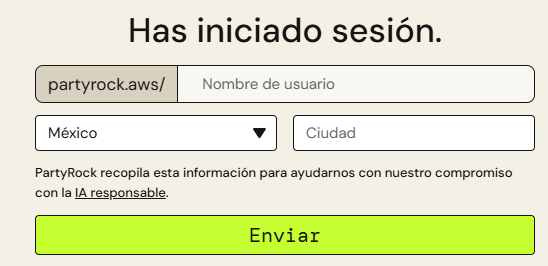
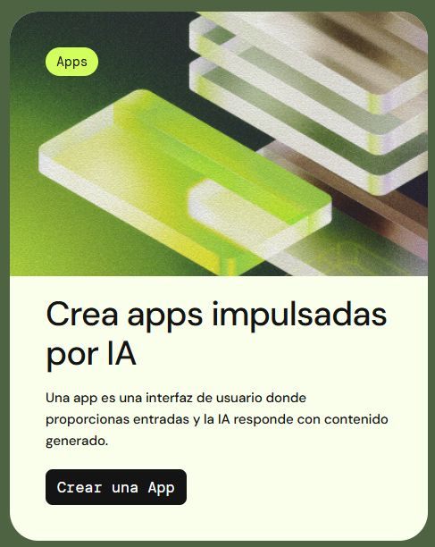
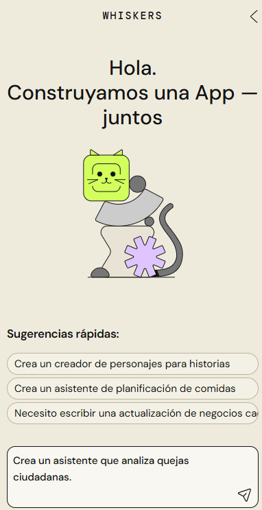
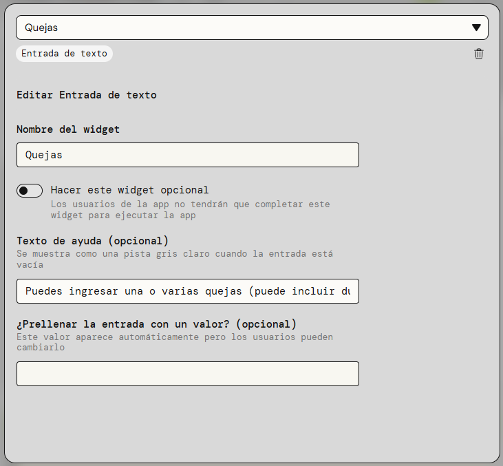
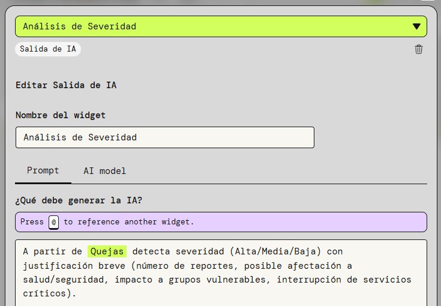
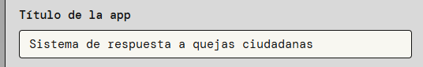
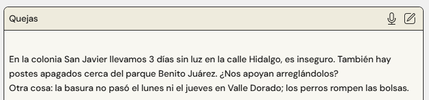
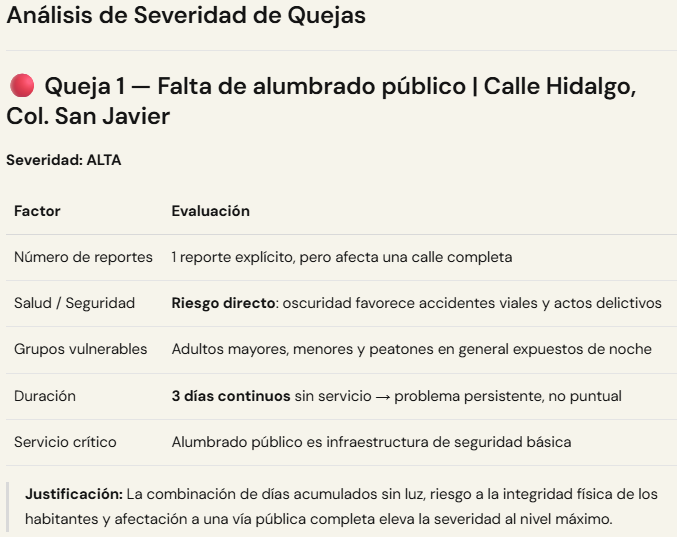
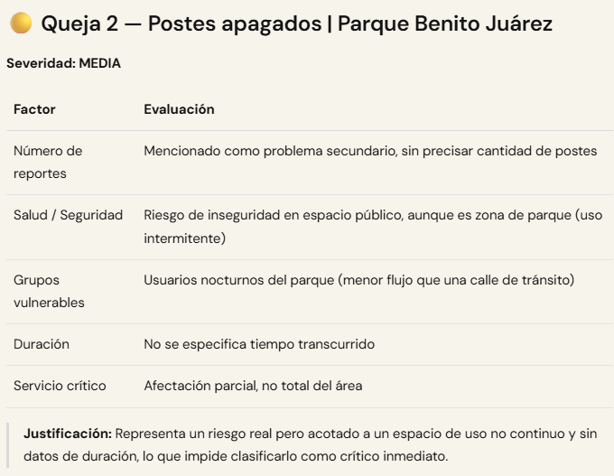
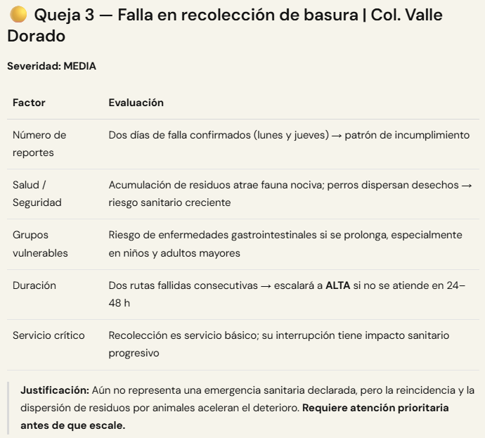

# Práctica 1. Explorar integraciones de IA en PartyRock
## Objetivo
Explorar de forma interactiva cómo funciona la IA generativa mediante el uso de PartyRock, identificando sus capacidades, tipos de interacción y diferencias frente a sistemas tradicionales.

## Duración aproximada
- 20 minutos.

## Tabla de ayuda
Para que puedas replicar esta práctica, se recomienda tener una cuenta personal en cualquiera de las siguientes plataformas:

| Sitio web | Enlace |
| --- | --- | 
| Amazon | https://www.amazon.com.mx | 
| Google | https://accounts.google.com/signup |
| Apple | https://appleid.apple.com/account |

## Instrucciones 
Sigue los pasos a continuación para completar cada tarea que conforma la práctica.

### Parte 1. Acceso y exploración inicial
1. Abre tu explorador web (Chrome, Edge o Firefox recomendado) preferido.
2. Ingresa al sitio oficial de PartyRock: [partyrock.aws](https://partyrock.aws/home). 
3. Inicia sesión con tu cuenta personal de Amazon, Apple o Google.
    - Define tu nombre de usuario.
    - Define la región en la que te ubicas.
    

4. En el menú Inicio, desplázate hacia abajo hasta encontrar la sección "Apps de nuestra comunidad" y selecciona una aplicación de algún área que te resulte interesante (Carrera y trabajo, Aprendizaje y creatividad o Estilo de vida y bienestar).
5. Ejecuta la aplicación ingresando los prompts que se te soliciten.
6. Observa cuidadosamente:
    - Qué tipo de respuesta genera
    - Qué tan detallada es la respuesta
    - Si cambia el resultado al modificar la entrada
7. Repite el proceso con otra aplicación distinta.
8. Con base en lo observado, responde:
    - ¿La IA siempre responde igual ante la misma entrada?
    - ¿Qué pasa si das instrucciones más específicas?
    - ¿Notas creatividad o solo repetición de patrones?
9. Modifica las entradas en una de las apps:
    - Primero escribe algo muy general
    - Luego escribe algo más específico y detallado
    - Compara ambos resultados y analiza:
        - ¿Cuál fue mejor?
        - ¿Por qué?

### Parte 2. Creación de tu primera app con IA
1. En el menú Inicio, haz clic en "Crear una App".

    

2. Selecciona un prompt ejemplo o empieza desde cero.

    

3. Configura al menos un componente de entrada, es decir, un campo de texto para que el usuario escriba información.

    

4. Agrega al menos un componente de salida (IA):
    - Configura una instrucción simple, por ejemplo:
    

5. Asigna un título a tu app.

    

6. Ejecuta tu aplicación:

    

    - Ingresa diferentes textos

    

    - Observa cómo responde
    
    
    
    

### Reflexión 
Reflexiona y responde:
- ¿Qué diferencia hay entre esta IA y un sistema tradicional (como un buscador)?
- ¿Qué tipo de tareas podrías automatizar con algo así en tu trabajo?
- ¿Qué tan importante crees que es la forma en que redactas las instrucciones?

#### Resultado esperado
Al finalizar esta práctica, el participante será capaz de:
- Reconocer cómo interactuar con una IA generativa
- Entender que la calidad del resultado depende de la entrada
- Identificar aplicaciones reales basadas en IA generativa que puedan ser utilizadas su entorno laboral
- Crear una primera solución básica con IA sin código