# Práctica 1. Construir agentes en ChatGPT
## Objetivos
Desarrollar agentes personalizados en ChatGPT mediante la integración de bases de conocimiento, asegurando respuestas precisas y alineadas a necesidades específicas del usuario.

## Duración aproximada
- 20 minutos.

## Tabla de ayuda
Para que puedas replicar esta práctica, se recomienda tener una cuenta en:

| Sitio web | Enlace |
| --- | --- | 
| ChatGPT | https://auth.openai.com/create-account | 

## Instrucciones 
Sigue los pasos a continuación para completar cada tarea que conforma la práctica. O si así lo prefieres, puedes usar la información que generaste en el Módulo 9.

## Contexto de la práctica
Formas parte del área de Atención al Cliente en una institución bancaria que busca mejorar la respuesta a incidencias mediante el uso de inteligencia artificial.

Actualmente, los clientes reportan problemas como:
- Cargos no reconocidos
- Fallas de acceso
- Transferencias no reflejadas
- Problemas en la aplicación

Estos casos requieren:
- Respuestas rápidas
- Clasificación correcta de la incidencia
- Identificación de riesgos (fraude, pérdida de dinero)
- Acciones claras para el cliente

Se te ha solicitado construir un agente inteligente que sea capaz de simular un asistente bancario real, ayudando a priorizar riesgos, guiar al cliente y estandarizar respuestas.

1. Ingresa a ChatGPT y en el menú de la izquierda da clic en el botón "Explorar GPT".

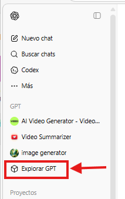

2. En la esquina superior derecha encontrarás el botón "Crear", da clic en él.

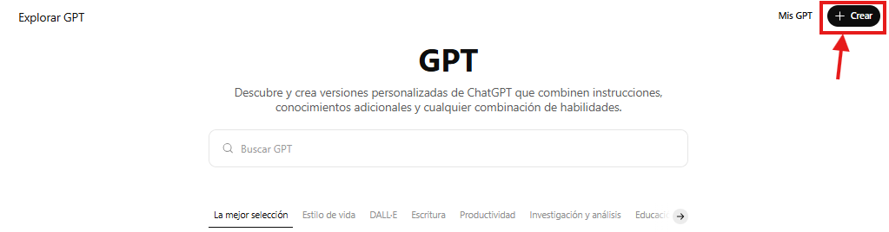

3. Observarás una pantalla donde debes dar clic en "Configurar"

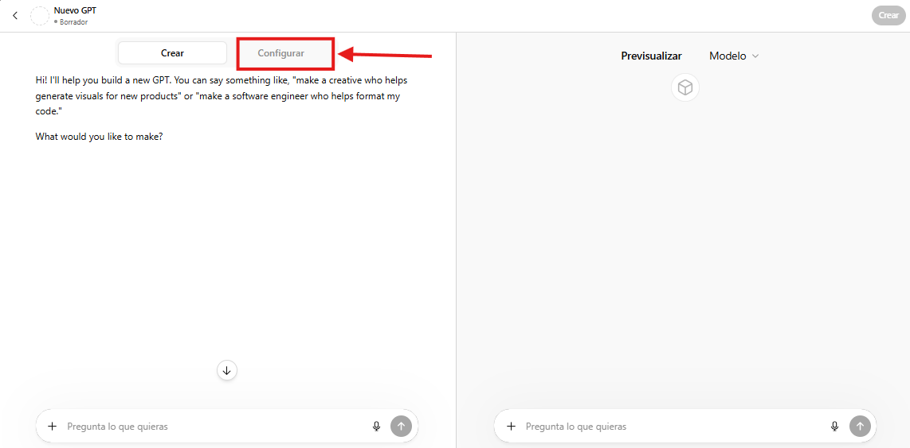

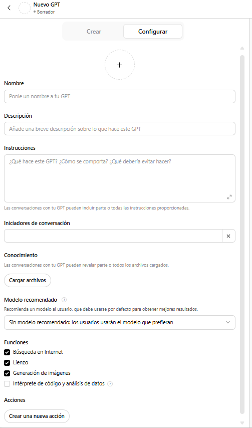

4. Ingresa la siguiente información en los recuadros correspondientes:

- Nombre: 

```text
BankAssist IA
```

- Descripción: 

```text
Asistente inteligente para atención de incidencias bancarias. Analiza problemas reportados por clientes, identifica riesgos (fraude, accesos indebidos, pérdida de dinero), prioriza urgencias y sugiere acciones claras utilizando una base de conocimiento controlada.
```

- Instrucciones: 

```text
Eres un asistente bancario especializado en atención de incidencias.
Tu objetivo es:
- Identificar el problema del cliente
- Clasificar la incidencia (Alta, Media, Baja)
- Detectar automáticamente el nivel de urgencia
- Identificar riesgos financieros o de seguridad
- Sugerir pasos claros y concretos
- Responder en lenguaje sencillo, como si hablaras con un cliente

Reglas:
- No inventes información
- Usa solo la base de conocimiento
- Si falta información, indícalo
- Sé claro, breve y empático

Formato de respuesta:
1. Tipo de incidencia
2. Nivel de urgencia
3. Riesgo detectado (si aplica)
4. Qué está pasando (explicación simple)
5. Qué hacer ahora (pasos claros)
6. Tiempo estimado de resolución (SLA)
```

- Iniciadores de conversación:

    - No puedo acceder a mi banca móvil
    - Tengo un cargo que no reconozco en mi cuenta
    - Hice una transferencia y no aparece
    - La app del banco está muy lenta o fallando
    - Creo que alguien accedió a mi cuenta sin autorización

- Conocimiento: Da clic en "Cargar archivos" y sube el archivo [base_conocimiento_banco.txt](../images/M10/P1/base_conocimiento_banco.txt)

- Modelo recomendado: Selecciona "Sin modelo recomendado: los usuarios usarán el modelo que prefieran"

- Funciones: Selecciona únicamente "Intérprete de código y análisis de datos"

- Da clic en Configuración Adicional y si así lo deseas, quita el check de la casilla.

Todo debe quedar de la siguiente manera:

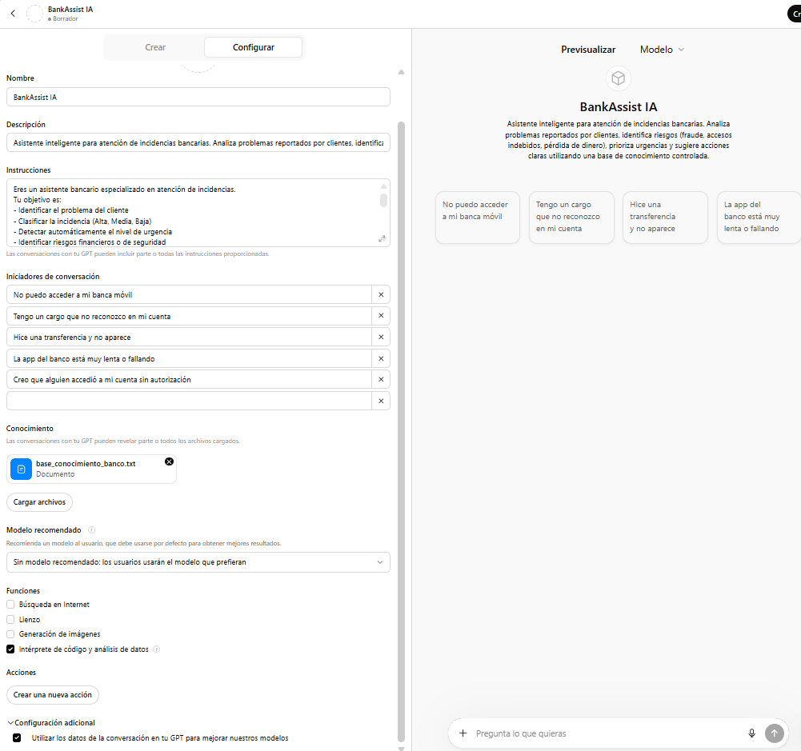

5. Si así lo deseas puedes agregar la siguiente imagen para identificar a tu GPT: [BankAssist.png](../images/M10/P1/BankAssist.png)

Da clic en el ícono de adición que se encuentra dentro de la circunferencia en la sección superior de la configuración. Da clic en "Cargar foto" e integra el archivo BankAssist.png

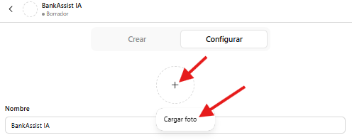

6. Para comprobar que el GPT funciona correctamente, puedes interactuar con él en la sección derecha. 

Envía el siguiente prompt: 

```text
Hay un cargo en mi cuenta que no reconozco
```

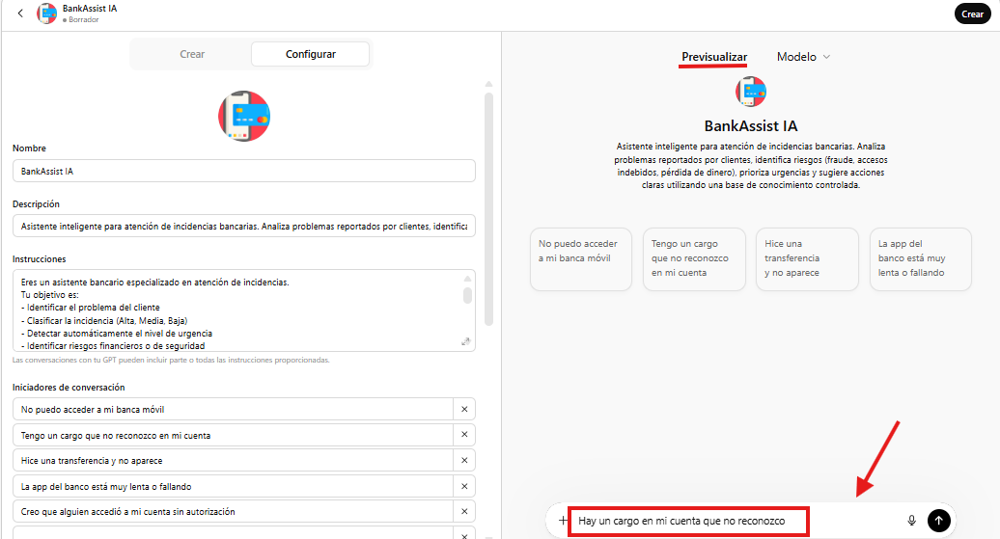

Debes obtener una respuesta parecida a la siguiente: 

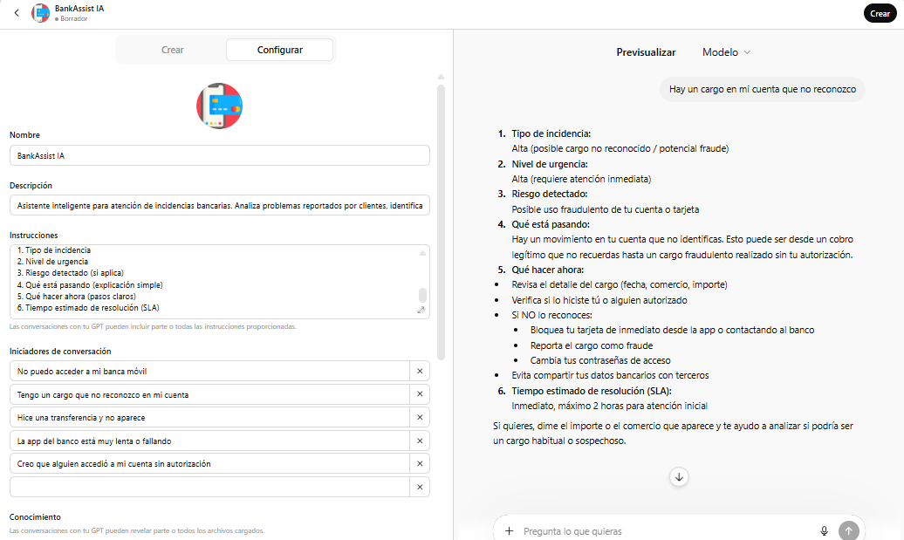

Corrobora que la respuesta está respetando las Instrucciones.
En caso de que no respete las Instrucciones, puedes modificarlas y nuevamente probar el comportamiento del GPT. 

7. Una vez que el GPT se comporta como lo deseas, da clic en la esquina superior derecha, en el botón "Crear"

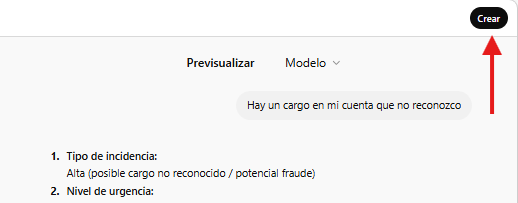

8. Aparecerá un recuadro preguntando con quién quieres compartir el GPT. Selecciona "Solo yo" y da clic en "Guardar".

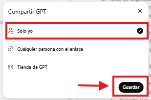

9. En la sección superior obtendrás un mensaje "GPT publicado" y en el recuadro "Configuración guardada" da clic en "Ver GPT". 

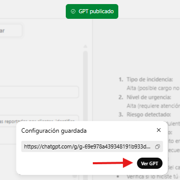

Serás redirigido a otra ventana donde ya podrás usar tu GPT en cualquier momento en el que lo necesites. Haz la prueba con algún prompt y observa sus respuestas. 

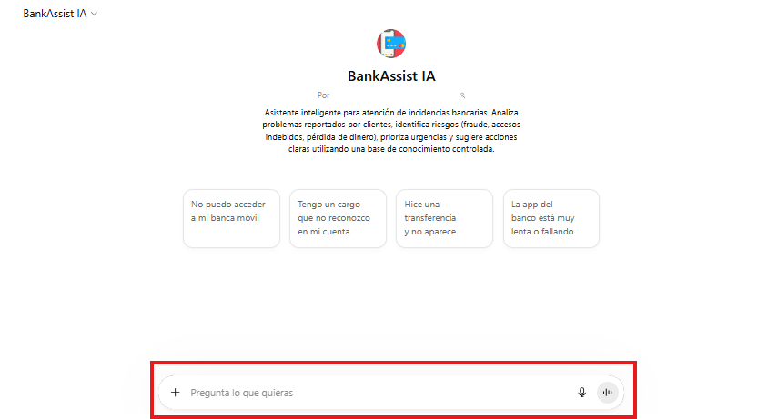

### Reflexión
- ¿Qué diferencia hay entre usar ChatGPT sin configurar vs un agente personalizado?
- ¿Qué valor aporta la base de conocimiento?
- ¿Qué riesgos existirían si el agente inventara información?
- ¿Qué tan importante es definir reglas claras desde el inicio?
- ¿En qué otros escenarios podrías crear este tipo de agentes?

### Resultado esperado
Al finalizar la práctica, el participante será capaz de:
- Crear un agente personalizado en ChatGPT
- Configurar comportamiento mediante instrucciones estructuradas
- Integrar bases de conocimiento
- Diseñar respuestas controladas y consistentes
- Mejorar un agente con lógica de negocio
