# Práctica 2. Procesar documentos masivos con AI Studio
## Objetivos
Utilizar plataformas de IA para analizar grandes volúmenes de documentos no estructurados, extrayendo información clave que facilite la toma de decisiones empresariales.

## Duración aproximada
- 15 minutos.

## Tabla de ayuda
Para que puedas replicar esta práctica, se recomienda tener una cuenta en la siguiente plataforma:

| Sitio web | Enlace |
| --- | --- | 
| Google AI Studio | https://aistudio.google.com/ |

## Instrucciones 
Sigue los pasos a continuación para completar cada tarea que conforma la práctica. O si así lo prefieres, puedes usar la información que generaste en el Módulo 9.


## Contexto de la práctica
Ejerces el rol de Especialista en Legal Operations (Legal Ops) en una firma de consultoría corporativa. Tu equipo ha recibido un paquete de 11 contratos de confidencialidad (NDAs) que están listos para ser enviados a firma, pero te han informado que hubo un error en la plantilla base: algunos contratos podrían tener omisiones en cláusulas críticas (como la jurisdicción o la duración) o datos de contacto incompletos. Revisar uno por uno te tomaría horas; tu objetivo es usar la potencia de procesamiento por lotes de Google AI Studio para auditar los 11 documentos en un solo paso, identificar los campos vacíos y generar una tabla de control para el equipo de gestión de firmas.

### Parte 1. Descarga de archivos

1. Dirigete a la carpeta [archivos_NDA](../images/M7/P4/) y descarga todos los archivos que se encuentran en ella.

### Parte 2. Creación de cuenta

1. Ingresa a [Google AI Studio](https://aistudio.google.com/)
2. Da clic a "Get Started" en el botón que se encuentra en la sección superior derecha o en la sección central de la pantalla.

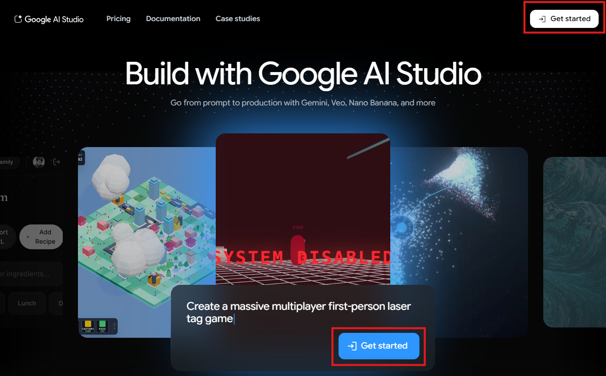

3. Coloca el correo electrónico que se te asignó y sigue los pasos para loggearte correctamente (podría solicitar tu contraseña o una clave de acceso que encontrarás en el archivo .txt en tu escritorio). Acepta los términos de servicio en caso de que aparezcan.

4. Podrás observar la siguiente pantalla:

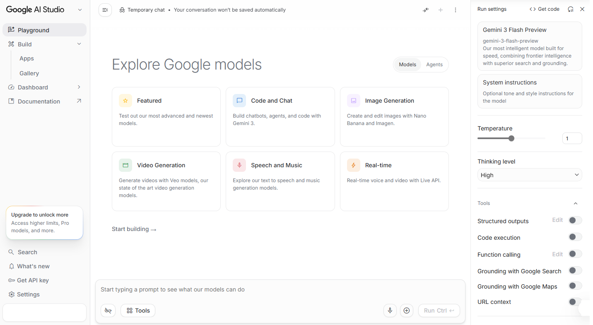

### Parte 3. Configuración del entorno en Google AI Studio
A diferencia de la interfaz de chat convencional, AI Studio nos permite cargar múltiples archivos pesados para que el modelo los analice como un solo conjunto de datos.

1. En el panel derecho "Run settings", asegúrate de seleccionar el modelo "Gemini 3 Flash Preview"
2. Ubica el deslizador de Temperature y ajústalo a 0.1.

La Temperatura es un parámetro que regula la aleatoriedad de las palabras que elige el modelo.
- Una temperatura alta (cercana a 1.0) hace que la IA sea más creativa y variada (ideal para poemas o correos).
- Una temperatura baja (cercana a 0.1) obliga a la IA a ser más precisa, literal y basada estrictamente en los datos proporcionados. En el área legal, se recomienda usar temperaturas bajas para evitar "alucinaciones" o inventos.

3. En Thinking Level puedes seleccionar qué tan profundo deseas que se lleve a cabo el análisis de la información.

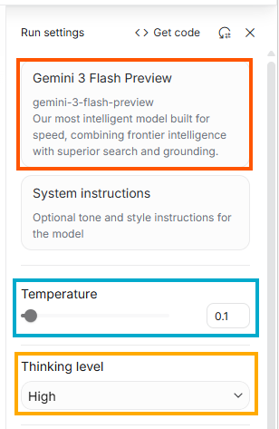

4. Da clic en System instructions, asígnale el título "System prompt" y escribe lo siguiente:

```text
Actúa como un Auditor Legal experto. Analiza los 11 documentos adjuntos.
Tu objetivo es identificar el estatus de cada contrato para ver si está listo para enviarse al cliente o si tiene campos pendientes de llenar.

Genera una tabla comparativa con las siguientes columnas:
1. Nombre del Archivo.
2. Cliente/Parte Contratante (Si no tiene, indica "PENDIENTE").
3. Duración del acuerdo (Busca el término en años).
4. Jurisdicción (Estado/País).
5. Campos faltantes (Indica específicamente qué partes tienen líneas en blanco o corchetes [ ]).

Al final de la tabla, haz un resumen de cuántos contratos están listos al 100% y cuántos requieren corrección manual.
```

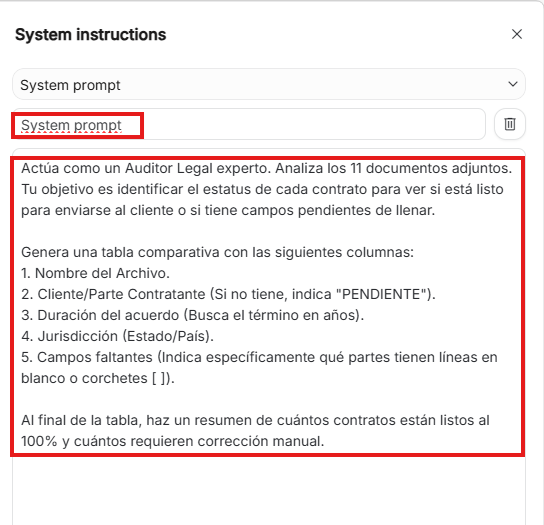

5. En la sección inferior encontrarás un ícono de "+", al dar clic en él observarás un menú. Selecciona "Upload Files" y después agrega los 11 archivos que descargaste en la Parte 1.

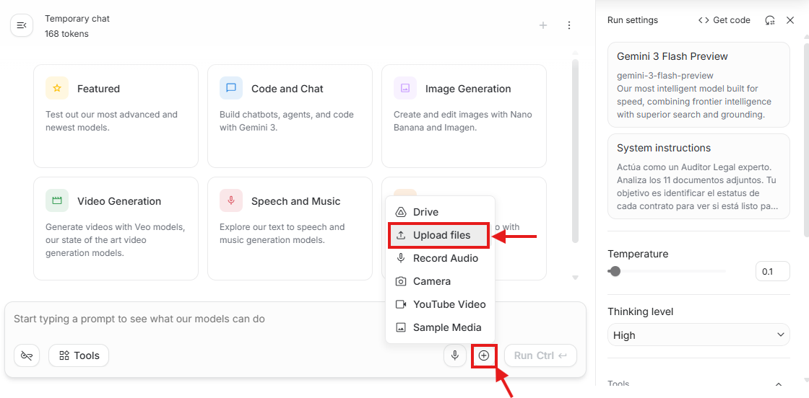

En caso de que observes esta información, da clic en "Acknowledge":

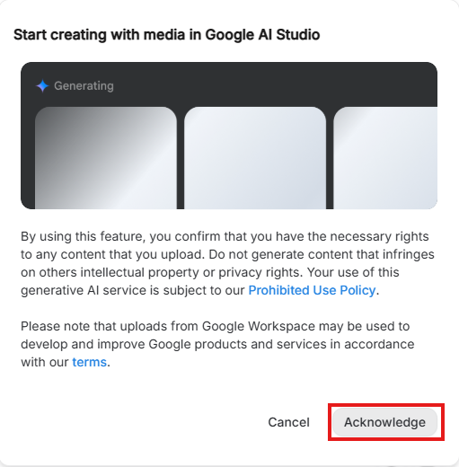

Una vez que todos los archivos se hayan cargado, los podrás observar de la siguiente manera:

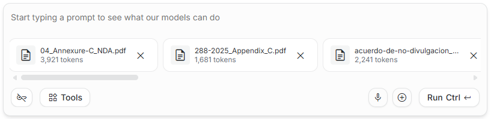

Los tokens que aparecen en cada uno de los archivos representan la unidad básica de información que el modelo procesa. En conjunto, estos 11 archivos consumen una fracción mínima de la Ventana de Contexto de Gemini (que permite hasta 1 millón de tokens), lo que garantiza que la IA pueda "leer" todos los contratos simultáneamente sin olvidar detalles de los primeros archivos al llegar a los últimos.

### Parte 4. Ejecución e interacción 

1. Presiona Run. Verás cómo Gemini procesa todos los archivos en paralelo y genera la respuesta en segundos.

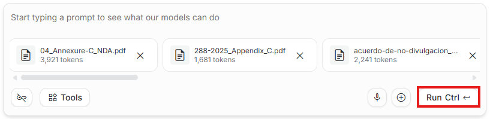

2. Lee la respuesta final generada. ¿Cumple con todas las instrucciones definidas en "System Instructions"? 

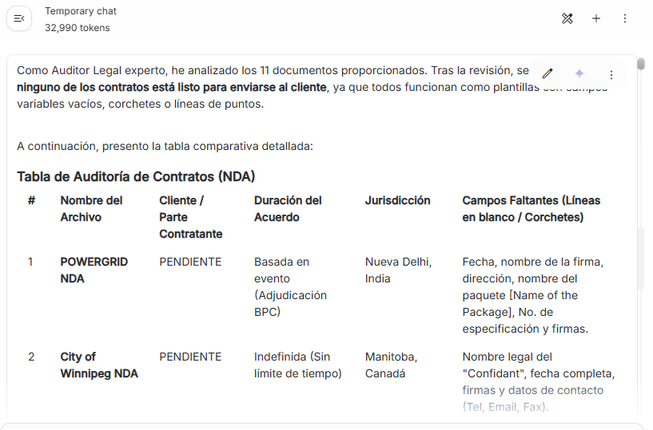

- ¿Consideras que una revisión manual de "lectura rápida" hubiera identificado los campos faltantes de cada archivo con la misma velocidad y precisión que la IA?

### Parte 5. Análisis de Riesgos y Cláusulas Críticas
Una vez que tenemos la tabla, debemos actuar como consultores estratégicos. La auditoría reveló que ningún contrato está listo y que existen discrepancias peligrosas en las duraciones.

En el cuadro de chat principal (User prompt), escribe la siguiente instrucción para que Gemini analice la coherencia del lote y ejecútalo:

```text
Basado en la tabla de auditoría que generaste, realiza un diagnóstico de riesgos específicos:
1. Alerta de Duración: Identifica por nombre los contratos que tienen una duración "Indefinida" (como Winnipeg) y explica por qué esto es un riesgo frente a los que solo duran 2 o 5 años.
2. Discrepancia Geográfica: La empresa opera globalmente, pero tenemos jurisdicciones en India, Sudáfrica, Canadá y México. ¿Qué contrato tiene la jurisdicción más inusual o difícil de litigar para una empresa basada en España?
3. Análisis de placeholders: ¿Cuál es el campo faltante que más se repite en los 11 documentos y qué proceso interno crees que está fallando para que esto ocurra?
```

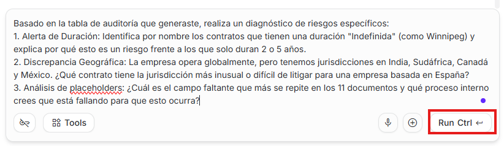

- ¿Qué valor aporta que la IA encuentre los riesgos asociados a cada archivo?

### Parte 6. Recomendaciones de Estandarización Legal (Legal Ops)
El objetivo de Legal Operations es transformar los datos en procesos eficientes. Tras detectar que el 100% de los contratos fallan en la identificación de la contraparte y que existen riesgos de perpetuidad, procederemos a estandarizar la solución.

Ejecuta el siguiente prompt para que Gemini diseñe la estrategia de mejora:

```text
Como experto en Legal Ops, genera un informe de estandarización basado en los riesgos detectados (perpetuidad en Winnipeg/GEO-SON y falta de KYC):

1. Redacción de Cláusula Maestra: Genera una cláusula de "Vigencia y Terminación" que limite la confidencialidad a 5 años, eliminando el riesgo de "perpetuidad" encontrado en los contratos de Canadá y EE. UU.
2. Protocolo de Jurisdicción: Crea una política donde, para contratos internacionales (como el de Powergrid en India o Transnet en Sudáfrica), se exija una cláusula de arbitraje internacional en un territorio neutral para evitar los tribunales locales.
3. Formulario de Intake (KYC): Diseña un checklist de 5 campos obligatorios que el equipo comercial debe completar antes de que el área legal acepte revisar un contrato, para evitar que el 100% de los archivos lleguen con el nombre del cliente "PENDIENTE".
```

- ¿Qué valor aporta que la IA proponga la redacción de la solución de forma inmediata basada en los riesgos específicos de tu empresa?

### Parte 7. Visualización de Datos Estratégica
Para que la dirección comprenda por qué es urgente cambiar el proceso, convertiremos la auditoría en una métrica visual de riesgo.

Escribe el siguiente prompt para generar una estructura de gráfico:

```text
Genera el código para un gráfico de barras (o una representación visual en formato Markdown) que compare los 11 contratos bajo un "Índice de Riesgo Legal" (Escala 1-10).

Criterios para la IA:
- Asigna un 10 (Riesgo Crítico) a POWERGRID por jurisdicción y evento incierto.
- Asigna un 8 a Winnipeg y GEO-SON por ser "Indefinidos".
- Asigna un 5 a los contratos con jurisdicción local conocida (España/México) pero con placeholders vacíos.

El objetivo es visualizar que la falta de estandarización está creando picos de riesgo innecesarios para la compañía.
```

Podrías obtener como resultado algo parecido a:

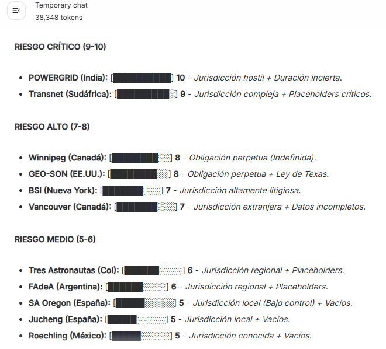

- ¿Cómo cambia la recepción de tu trabajo por parte de un directivo cuando, en lugar de un listado de archivos, presentas una gráfica de riesgos?

### Parte 8. Propuesta de Protocolo y Normalización Masiva
En esta etapa final, utilizaremos a Gemini para crear una "Plantilla Maestra" y, lo más importante, le pediremos que reescriba de forma lógica los puntos críticos de los contratos originales para que se ajusten a nuestros nuevos estándares de seguridad.

Ejecuta el siguiente prompt de ejecución masiva:

```text
Ahora, actúa como un sistema de automatización legal. Realiza las siguientes dos tareas:

1. Genera una "Plantilla Maestra de NDA 2026" que incluya las cláusulas de vigencia (5 años) y jurisdicción neutral que definimos anteriormente, dejando los espacios claramente marcados para los datos del KYC.

2. Basado en los 11 contratos originales cargados, genera un listado de 'Modificaciones Sugeridas' para cada uno. Específicamente, indica cómo debería quedar redactada la cláusula de vigencia en los contratos de Winnipeg y GEO-SON para que dejen de ser indefinidos y se acoplen a nuestra nueva plantilla maestra.
```

- ¿Qué tan viable sería realizar esta "normalización" de 11 criterios distintos hacia una sola plantilla maestra?

### Reflexión
- ¿Qué ventajas encuentras en poder elegir entre los distintos modelos de Gemini y el nivel de pensamiento según la complejidad de tus archivos?
- ¿Cómo mejora la consistencia del análisis el hecho de separar las "reglas de comportamiento" (System) de las "órdenes de ejecución" (User)?
- ¿Qué nivel de seguridad te aporta poder reducir la Temperatura a 0.1 para garantizar que la IA no "invente" cláusulas inexistentes?
- ¿Cómo cambia tu flujo de trabajo el poder cargar varios documentos en un solo paso en lugar de copiar y pegar fragmentos de texto en un chat convencional?


### Resultado esperado
Al finalizar esta práctica, el participante habrá logrado:
- Configurar un entorno de trabajo avanzado en Google AI Studio, seleccionando modelos específicos según la necesidad de la tarea.
- Arquitectura de Prompts: Diseñar instrucciones estructuradas mediante el uso de System Instructions, asegurando que la IA actúe bajo un rol de experto legal con reglas de comportamiento inamovibles.
- Control de Precisión: Ajustar parámetros técnicos (Temperatura) para garantizar resultados objetivos, eliminando alucinaciones y priorizando la extracción literal de datos en entornos críticos.
- Procesamiento Multimodal y Masivo: Ejecutar auditorías, visualizaciones de riesgo y normalización de documentos a escala, aprovechando la ventana de contexto para analizar múltiples fuentes de información de manera simultánea y coherente.
- Estandarización de Procesos: Transformar el análisis de datos no estructurados en protocolos de Legal Ops, generando soluciones que impactan directamente en la eficiencia y seguridad jurídica de una organización.

