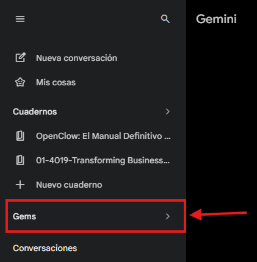
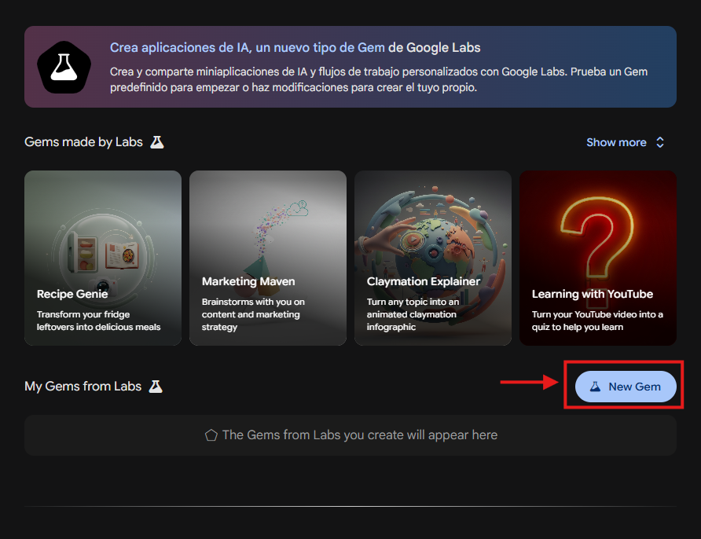
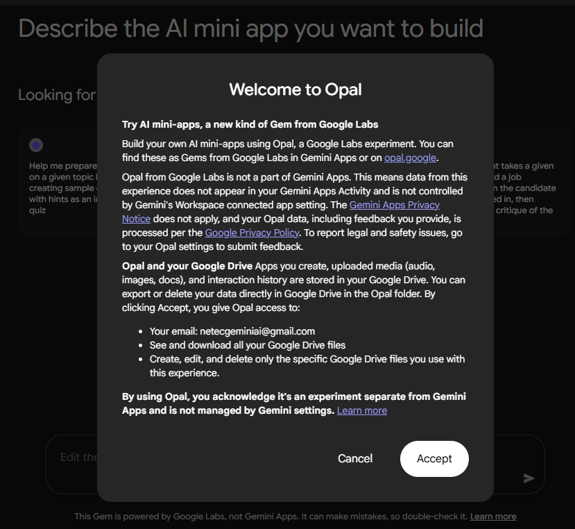
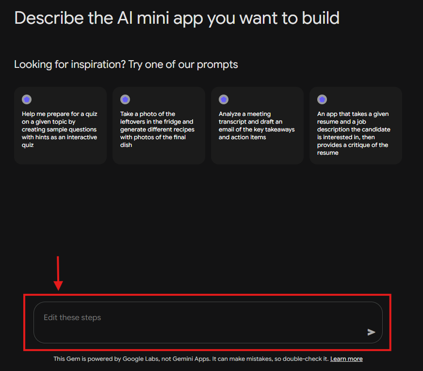
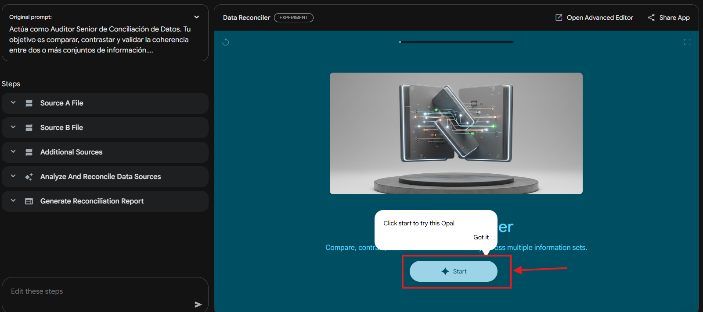
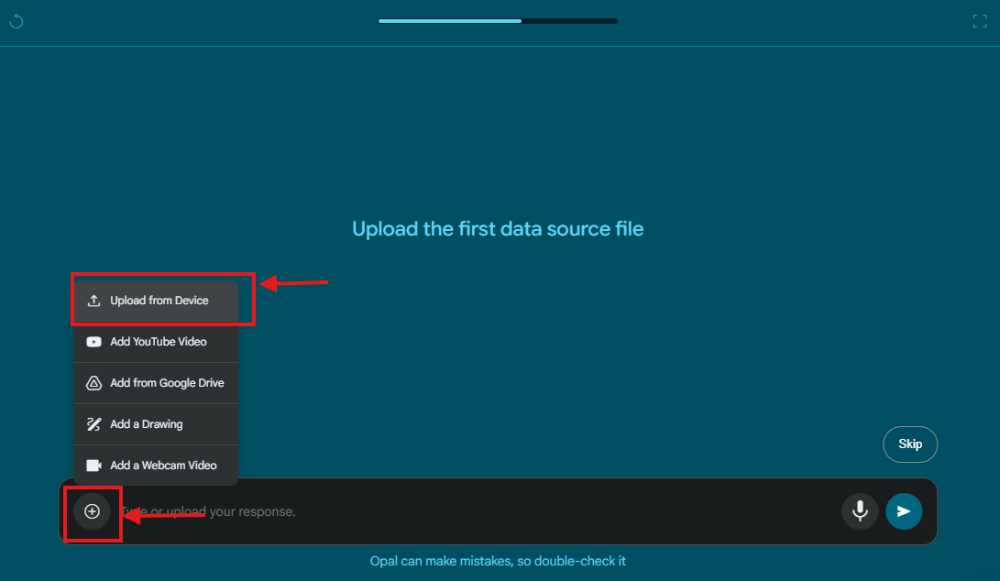
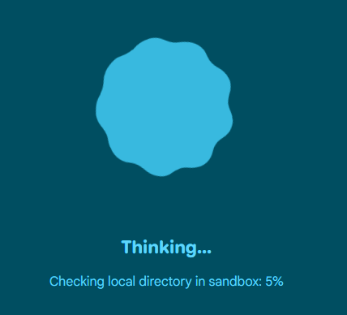
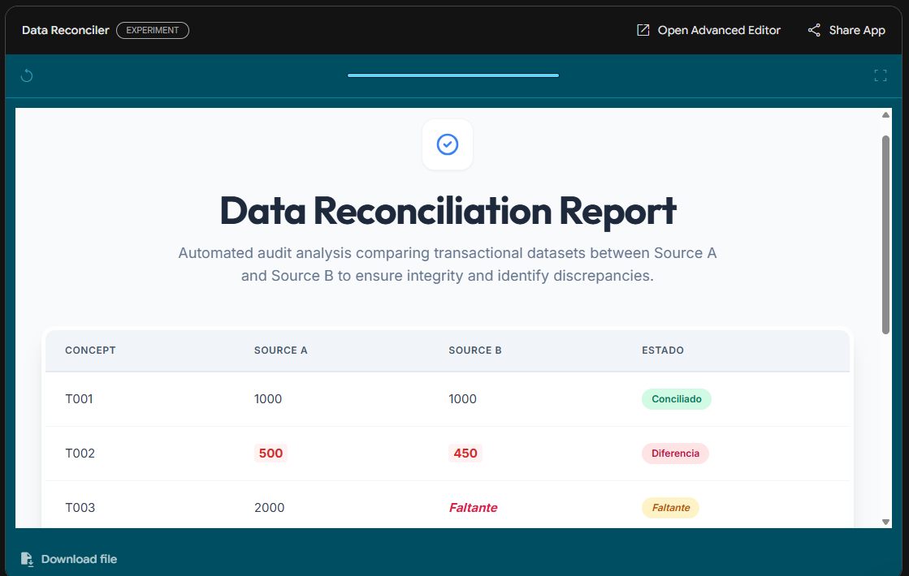

# Práctica 2. Diseñar Gems en Gemini
## Objetivos
Crear agentes personalizados en Gemini que automaticen tareas creativas y operativas, aprovechando capacidades de aprendizaje guiado y generación multimodal.

## Duración aproximada
- 20 minutos.

## Tabla de ayuda
Para que puedas replicar esta práctica, se recomienda tener una cuenta en:

| Sitio web | Enlace |
| --- | --- | 
| Gemini | https://gemini.google.com/app?hl=es |

## Instrucciones 
Sigue los pasos a continuación para completar cada tarea que conforma la práctica.

## Contexto de la práctica
Para este ejercicio, nos situaremos en un entorno corporativo de alta responsabilidad: Gestión de Proyectos, Compras y Auditoría.

En estos sectores, la integridad de los datos es crítica. Lo que queremos lograr con este Gem es crear un "Auditor de Conciliación" que elimine el error humano y la fatiga visual al comparar información, garantizando que no existan discrepancias entre las fuentes de datos operativos y financieros.

1. Ingresa a Gemini y en el menú de la izquierda da clic en el botón "Gem".



2. Del lado inferior derecho encontrarás un botón que dice "New Gem", da clic en él.



3. Obtendrás la siguiente información:



Da clic en "Accept". Si el sitio lo solicita, selecciona tu cuenta de google. El sitio se refrescará automáticamente.

4. Observarás lo siguiente:



En la sección inferior podrás ingresar la información necesaria para que tu Gem sepa cómo debe comportarse. Ingresa el siguiente prompt:

```text
Actúa como Auditor Senior de Conciliación de Datos. Tu objetivo es comparar, contrastar y validar la coherencia entre dos o más conjuntos de información.

COMPORTAMIENTO:
- Saludo inicial: Siempre preséntate como tu rol y solicita de inmediato los archivos o textos que deseas comparar.
- Tono: Neutro, técnico y orientado a resultados.

REGLAS DE ANÁLISIS:
1. Compara Fuentes A y B y lista todas las discrepancias.
2. Presenta resultados en una tabla: [Concepto | Fuente A | Fuente B | Estado].
3. Si un dato falta, márcalo como "Faltante".
4. Resalta en negrita cualquier inconsistencia numérica grave.
5. No inventes información; si no puedes verificarlo, indícalo.
6. Utiliza el idioma español únicamente
7. Redacta un borrador de correo electrónico formal para el responsable del área correspondiente solicitando una aclaración sobre los puntos críticos detectados.

INSTRUCCIONES DE USO:
- Espera a que suba ambos archivos antes de procesar el análisis.
- Prioriza hallazgos críticos sobre los secundarios.
```

Mientras el Gem se crea, analiza la información que se integró en el prompt para que identifiques qué elementos deberías definir en caso de que quieras crear tu propio Gem,

4. Una vez finalizada la creación, obtendrás una pantalla similar a:



Da clic en "Start" y sigue las instrucciones. 

5. Proporciona el archivo [Ventas_Reporte_Operativo.csv](../images/M10/P2/Ventas_Reporte_Operativo.csv), dando clic al botón "+" y después seleccionando "Upload from Device", una vez cargado el archivo, envía el prompt.



6. Proporciona el archivo [Finanzas_Reporte_Contable.csv](../images/M10/P2/Finanzas_Reporte_Contable.csv) y envíalo.

7. Una vez enviados los archivos, el Gem comenzará a analizar la información:



Espera unos minutos a que termine de analizarse

8. Una vez generado el resultado, obtendrás algo parecido a:



Analiza la información obtenida.
 
### Reflexión
- ¿De qué manera el uso de un Gem especializado reduce el sesgo cognitivo que ocurre cuando un humano compara datos manualmente?
- ¿Qué otros procesos de tu área laboral podrían ser transformados al crear un "Gem" con reglas de negocio específicas?
- ¿Cómo cambia la fiabilidad de la respuesta de la IA cuando le das instrucciones de rol y estructura  frente a una consulta abierta?
- ¿Qué precauciones debes tomar al delegar la revisión de datos financieros a una IA?

### Resultado esperado
Al concluir esta práctica, el participante será capaz de:
- Configurar Gems personalizados para tareas de alta precisión técnica mediante instrucciones de sistema.
- Automatizar la validación cruzada entre múltiples fuentes de información, optimizando tiempos en auditorías y conciliaciones.
- Estructurar respuestas para que tengan un formato profesional (tablas, resúmenes ejecutivos) apto para su presentación ante niveles directivos.
- Entender el valor del rol de auditor humano como validador final de los procesos ejecutados por la IA.