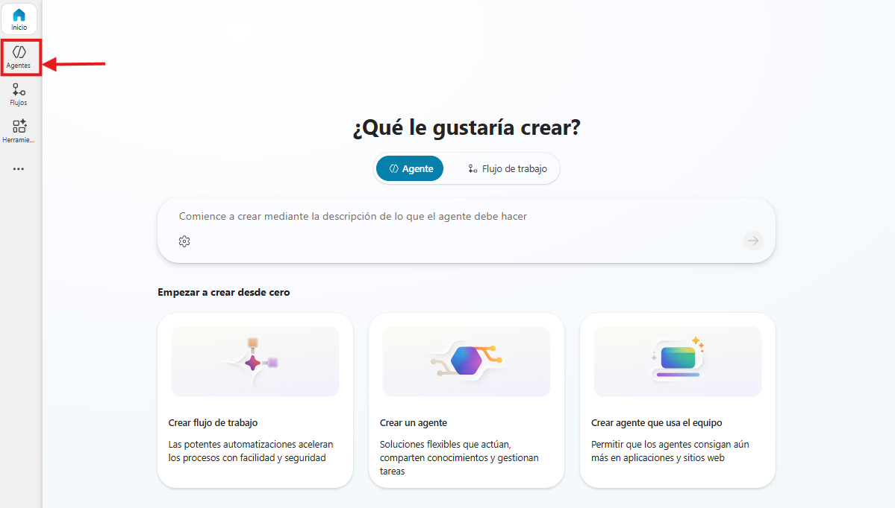
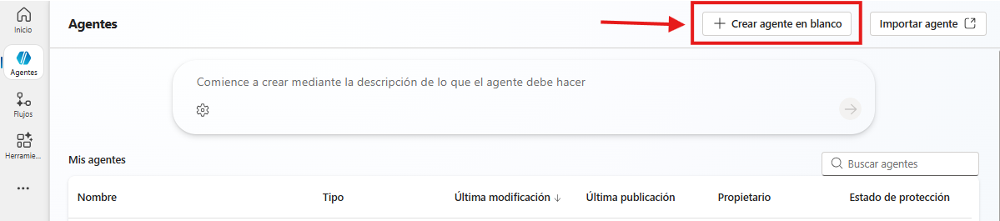
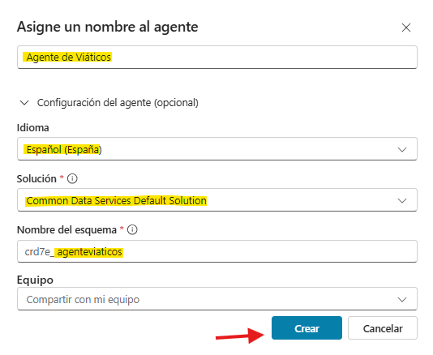
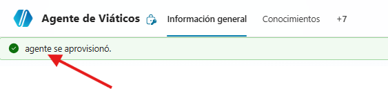

# Práctica 1. Implementar agentes en Copilot Studio
## Objetivos
Integrar un agente en un flujo de trabajo real utilizando Copilot Studio, automatizando tareas, consultas y procesos organizacionales de manera eficiente.

## Duración aproximada
- 45 minutos.

## Tabla de ayuda
Para que puedas replicar esta prácticas, se recomienda tener una cuenta en la siguiente plataforma:

| Sitio web | Enlace |
| --- | --- | 
| Copilot Studio | https://copilotstudio.microsoft.com | 

## Instrucciones 
Sigue los pasos a continuación para completar cada tarea que conforma la práctica. O si así lo prefieres, puedes usar la información que generaste en el Módulo 9.

## Contexto de la práctica
Trabajas en el área administrativa de una empresa.

Se requiere automatizar el proceso de: Solicitud y validación de viáticos

El agente deberá:
- Recibir solicitudes
- Analizarlas
- Validarlas con base en políticas
- Ejecutar una acción (flujo)
- Dar respuesta al usuario

### Parte 1. Crear el agente

1. Ingresa a Copilot Studio e inicia sesión con la cuenta que se te asignó.

Observarás la siguiente pantalla:

En la barra lateral izquierda da clic en "Agentes" y observarás una pantalla parecida a:

Da clic en "Crear agente en blanco". 

Ingresa la información que se te pide, ya sea información que generaste durante el Módulo 9 o lo que nosotros sugerimos:

Al finalizar da clic en "Crear".

Espera unos momentos a que se actualice la pantalla y todos los datos estén configurados de manera correcta. Una vez que observes el mensaje "agente se aprovisionó", puedes continuar con el resto de la práctica. 

2. 

### Reflexión
- ¿El agente realmente automatiza o solo responde?
- ¿Dónde podría fallar?
- ¿Qué pasaría si la base de conocimientos tiene datos incorrectos?
- ¿Qué mejorarías?
- ¿Qué diferencias notas con las plataformas del Módulo 10?

### Resultado esperado
El participante habrá construido:
- Un agente funcional integrado en el ambiente de Microsoft
- Con lógica de negocio
- Con validación de información
- Con integración a flujo