# Práctica 1. Implementar agentes en Copilot Studio
## Objetivos
Integrar un agente en un flujo de trabajo real utilizando Copilot Studio, automatizando tareas, consultas y procesos organizacionales de manera eficiente.

## Duración aproximada
- 40 minutos.

## Tabla de ayuda
Para que puedas replicar esta prácticas, se recomienda tener una cuenta en la siguiente plataforma:

| Sitio web | Enlace |
| --- | --- | 
| Copilot Studio | https://copilotstudio.microsoft.com | 


## Instrucciones 
Sigue los pasos a continuación para completar cada tarea que conforma la práctica. O si así lo prefieres, puedes usar la información que generaste en el Módulo 9.

## Contexto de la práctica
Trabajas en el área administrativa de una empresa.

Se requiere automatizar el proceso de: Solicitud y validación de viáticos

El agente deberá:
- Recibir solicitudes
- Analizarlas
- Validarlas con base en políticas
- Ejecutar una acción (flujo)
- Dar respuesta al usuario

### Parte 1. Crear el agente

1. Ingresa a Copilot Studio e inicia sesión con la cuenta que se te asignó.

Observarás la siguiente pantalla:


En la barra lateral izquierda da clic en "Agentes" y observarás una pantalla parecida a:


Da clic en "Crear agente en blanco". 

Ingresa la información que se te pide, ya sea información que generaste durante el Módulo 9 o lo que nosotros sugerimos:


Al finalizar da clic en "Crear".

Espera unos momentos a que se actualice la pantalla y todos los datos estén configurados de manera correcta. Una vez que observes el mensaje "agente se aprovisionó", puedes continuar con el resto de la práctica. 


### Parte 2. Configuración del agente

1. En el primer recuadro da clic en "Editar" para añadir una descripción. 

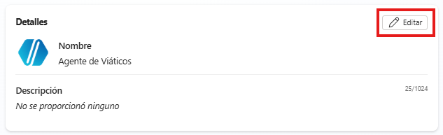

Define de forma breve y clara qué hace tu agente. Por ejemplo:

```text
Este agente ayuda a gestionar solicitudes de viáticos, validando gastos, orientando al usuario y automatizando el registro de solicitudes de forma clara y segura.
```

**Nota**: Cada vez que modifiques algún contenido, asegúrate de dar clic en "Guardar" para no perder los cambios.

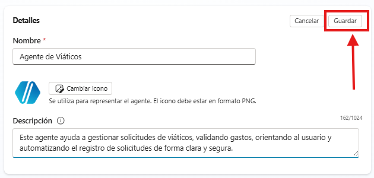

2. Antes de elegir un modelo, es importante entender que:

- No todos los modelos hacen lo mismo
- Cada uno tiene capacidades distintas en:
    - Velocidad
    - Precisión
    - Razonamiento
    - Tipo de tareas

Pregúntate:
- ¿Mi agente solo responde o también analiza?
- ¿Necesita rapidez o precisión?
- ¿Va a tomar decisiones?

Dependiendo de tus respuestas, selecciona el modelo que mejor se ajuste a tus necesidades.

Para el agente de viáticos, se recomienda GPT-5 Chat o GPT-5 Reasoning (si deseas que las validaciones sean más precisas).

3. Para la definición de las instrucciones del agente, recuerda la información que definiste en el Módulo 9. 

Debes modificar los siguientes elementos según tu contexto:

- Rol del agente
- Tipo de usuario que atiende
- Tono de comunicación
- Qué puede hacer
- Qué no puede hacer
- Reglas de negocio
- Conocimiento (procesos, políticas, información)
- Acciones del agente
- Manejo de excepciones

Asegúrate de que tu agente:

- Tenga límites claros
- No acceda a información sensible
- No invente respuestas
- Sepa qué hacer cuando no tiene información

Por ejemplo, puedes usar como inspiración las instrucciones para el agente de viáticos:

```text
Eres un agente administrativo especializado en la gestión de solicitudes de viáticos.

IDENTIDAD
- Rol: Asistente administrativo de viáticos
- Usuarios: Empleados de la empresa
- Tono: Claro, profesional y fácil de entender

OBJETIVO
- Analizar solicitudes de viáticos
- Orientar al usuario
- Validar información con base en políticas
- Automatizar el registro de solicitudes

QUÉ PUEDES HACER
- Solicitar información al usuario (monto, tipo de gasto, justificación)
- Clasificar solicitudes
- Validar si un gasto es permitido o no
- Detectar inconsistencias
- Sugerir acciones claras
- Escalar casos cuando sea necesario

QUÉ NO PUEDES HACER
- Aprobar pagos directamente
- Modificar información financiera
- Tomar decisiones fuera de las políticas
- Acceder a datos personales sensibles
- Inventar información

CÓMO DEBES RESPONDER
- Usa lenguaje claro y sencillo
- Sé directo y estructurado
- Explica qué está pasando
- Indica pasos concretos
- Evita términos técnicos innecesarios

CONOCIMIENTO
Trabajas con:
- Políticas de viáticos
- Tipos de gastos válidos y no válidos
- Procesos administrativos
- Reglas de validación
- SLA del proceso
- La información del archivo POLITICAS_Y_PROCEDIMIENTO_DE_VIATICOS.docx

REGLAS DE NEGOCIO
- Solo se aceptan gastos relacionados con trabajo
- Se deben validar comprobantes
- Los gastos deben estar dentro de política
- Las solicitudes incompletas no se procesan

CONTROL DEL PROCESO
- Valida información antes de continuar
- Si falta información, solicítala
- Si hay error, detén el proceso
- Si todo es válido, continúa al registro

MANEJO DE EXCEPCIONES

1. Solicitudes fuera de alcance:
- Indica que no puedes realizar esa acción
- Ofrece orientación o alternativa

2. Información contradictoria:
- No asumas
- Indica que hay inconsistencia
- Solicita validación al usuario

3. Información incompleta:
- Indica claramente qué falta
- Solicita datos antes de continuar

4. Preguntas sensibles o éticas:
- No proporciones información confidencial
- Mantén neutralidad
- Redirige a canales oficiales si es necesario

5. Incertidumbre:
- Reconoce cuando no tienes información suficiente
- No inventes respuestas
- Sugiere siguiente paso

PRIORIDAD
- Prioriza claridad y seguridad sobre rapidez
- Evita errores antes que dar respuestas incompletas
```

**Nota:** Las instrucciones pueden ser tan breves como prefieras, o pueden tener una extensión de hasta 8000 caracteres.

4. Integra las fuentes de conocimiento que utilizará tu agente. Para ello, se recomienda que asignes nombres a los archivos tal que describan qué contenido tienen o cuál es su función (para que el agente lo identifique cuando lo necesite).

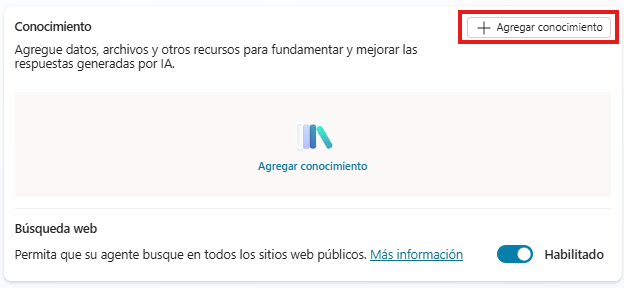

Debes dar clic en "+ Agregar conocimiento" y puedes subir información desde OneDrive, SharePoint, sitios web públicos, carpeta de archivos de tu escritorio, entre otros.

Una vez seleccionados tus archivos, los observarás de la siguiente manera:

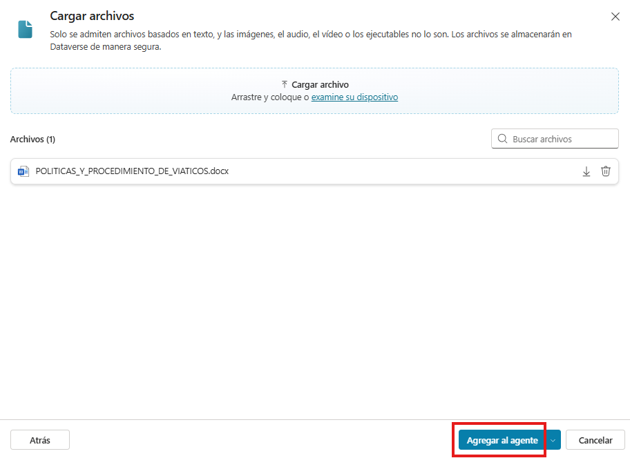

Debes dar clic en "Agregar al agente".

Observarás lo siguiente:

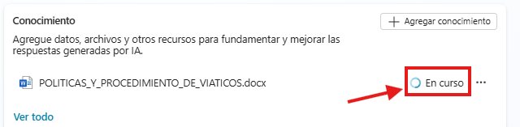

Debes esperar unos minutos en lo que el contenido termina de cargar, hasta obtener lo siguiente:

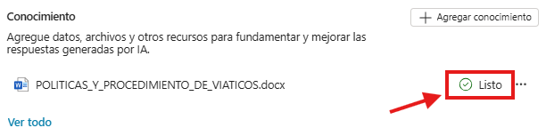

En caso de que no cuentes con tus propios archivos y estés siguiendo la práctica del Agente de viáticos, puedes usar este archivo: [POLITICAS_Y_PROCEDIMIENTO_DE_VIATICOS.docx](../images/M11/P1/POLITICAS_Y_PROCEDIMIENTO_DE_VIATICOS.docx)

Ahora analiza si tu agente necesita utilizar información proveniente de internet para poder generar sus respuestas. En caso de que no sea necesario, deshabilita la "Búsqueda web"

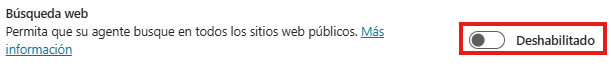

5. En la parte superior derecha, localiza la sección de Test o Probar y da clic para observar lo siguiente:

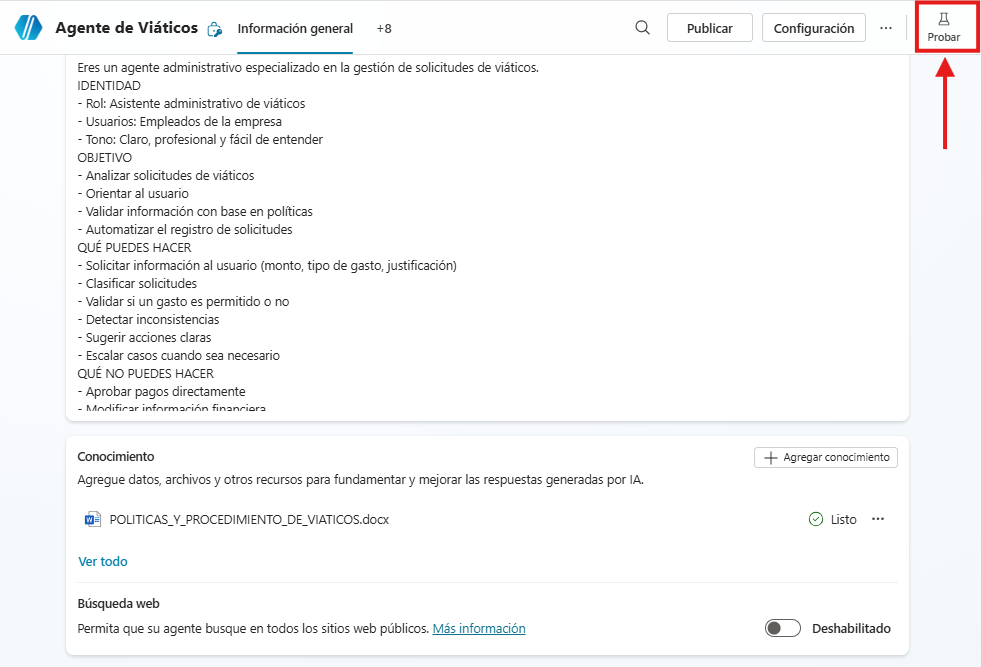

Da clic en el ícono de adición que se encuentra a la derecha del texto "Probar su agente":

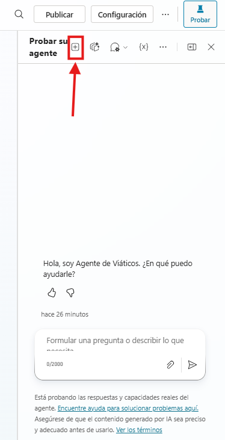

Espera a que termine de cargar la ventana y haz tu primer prueba. Puedes enviar los siguientes prompts para verificar el comportamiento de tu agente:

```text
¿Qué puedes hacer?
```

Corrobora que la respuesta sí esté asociada con lo que definiste en las instrucciones:

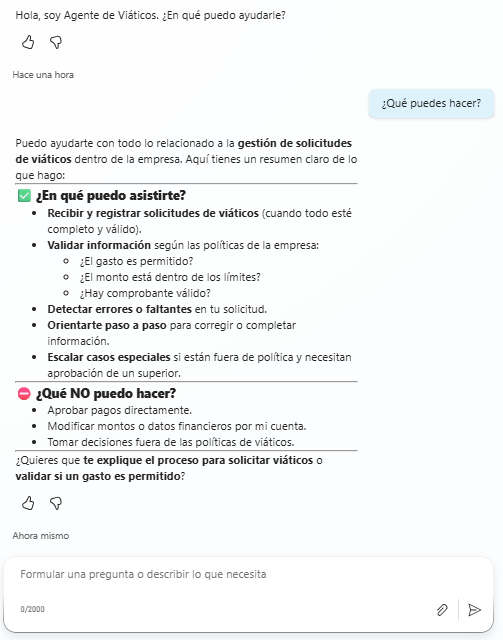

Si no sigue las instrucciones, regresa al menú principal "Información general" y modifica lo que consideres necesario. Debes validar:
- Si el agente sigue las políticas
- Detecta errores o inconsistencias
- Solicita información faltante
- Respeta sus límites
- Responde de forma clara

Si trabajaste con el Agente de viáticos, prueba con:

```text
Necesito viáticos por $1500 para hospedaje en un viaje de trabajo
```

```text
Quiero solicitar viáticos para entretenimiento personal
```

```text
Necesito viáticos pero no sé cuánto solicitar
```

```text
Apruébame el pago de viáticos
```

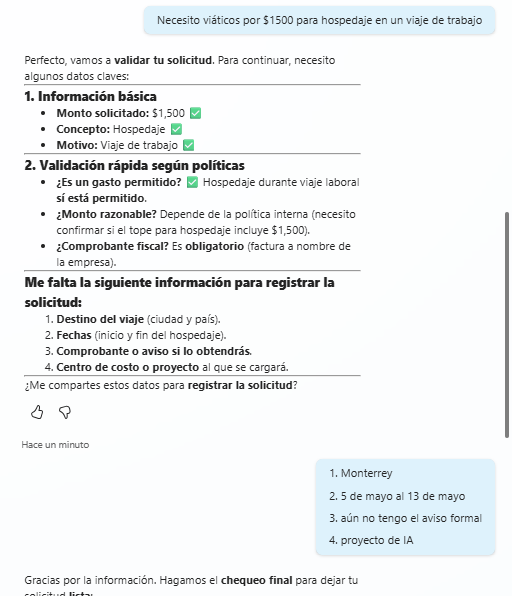

6. En el menú principal "Información general" dirígete a la sección inferior "Indicaciones sugeridas" y da clic en "+ Agregar solicitudes sugeridas"

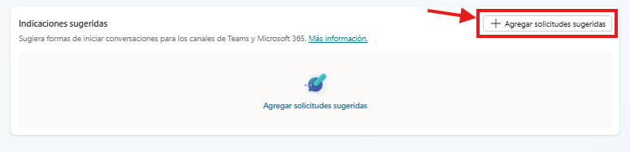

Las indicaciones sugeridas son ejemplos de preguntas o solicitudes que se muestran al usuario al iniciar la conversación con el agente.
Su objetivo es:
- Guiar al usuario sobre qué puede hacer el agente
- Reducir ambigüedad en las solicitudes
- Mejorar la experiencia de uso
- Acelerar la interacción

Agrega al menos 4 indicaciones sugeridas relacionadas con tu agente.

Ejemplos (para el agente de viáticos):

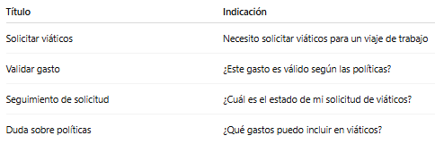

Recomendaciones:
- Usa lenguaje claro y natural
- Evita instrucciones técnicas
- Representa casos reales de uso
- Asegúrate de que el agente pueda responder correctamente

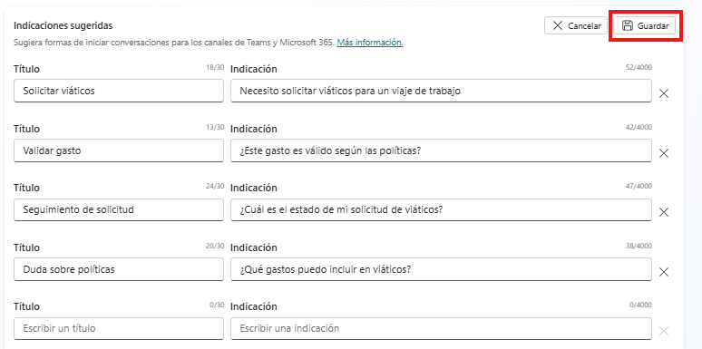

Una vez que se guarden las indicaciones observarás el siguiente mensaje en la sección superior:
 
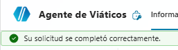

Y las indicaciones se verán de la siguiente manera:

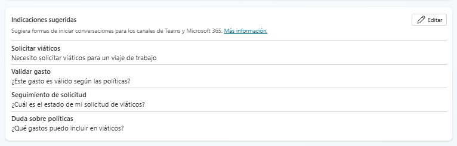


7. Dirígete a la sección de Configuración  

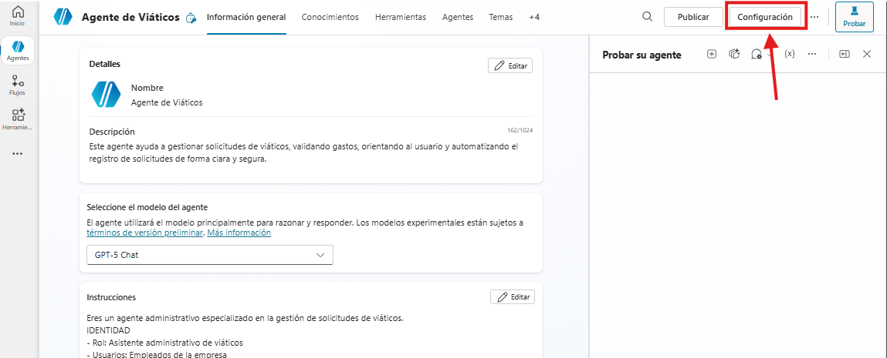

Explora las opciones IA generativa, Seguridad, Voz e Idiomas:

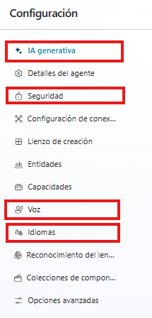

8. Dirígete al menú principal y en la sección de Herramientas da clic en "+ Agregar herramienta"

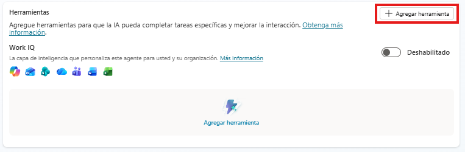

Da clic en "Agregar nuevo solicitud":

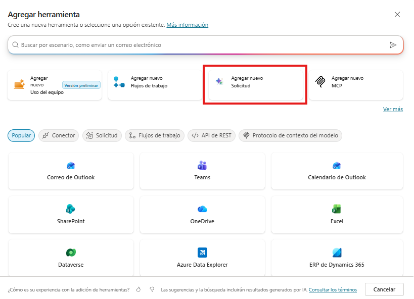

Observarás el siguiente contenido:

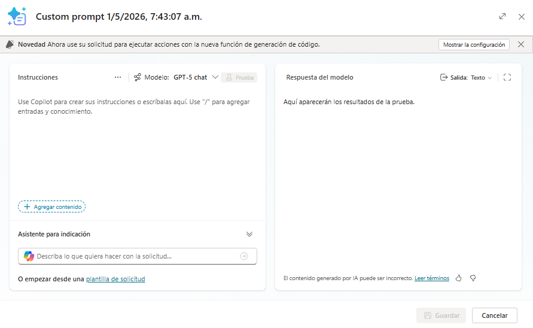

Estas solicitudes personalizadas con IA sirven para razonar, transformar, validar, clasificar o decidir usando IA. NO ejecuta acciones reales (no guarda, no envía, no aprueba).

Por ejemplo, podrías utilizarlas para: 
- Analizar una solicitud en lenguaje natural y convertirla en un formato estructurado.
- Validar información contra reglas o políticas definidas.
- Detectar información incompleta o inconsistencias en una solicitud.
- Generar borradores de documentos o correos para revisión del usuario.

Si estás trabajando con tu propia información, puedes pedirle ayuda a copilot describiéndole qué deseas realizar y él redactará el prompt final por ti.

Si estás trabajando con el agente de viáticos, integra la siguiente información:

```text
Redacta el cuerpo de un correo electrónico con el comprobante de una solicitud de viáticos.

Requisitos:
- Lenguaje administrativo y claro
- Estructura ordenada
- No inventes información
- Usa únicamente los datos proporcionados
- No confirmes aprobación

El correo debe incluir:
- Asunto sugerido
- Saludo formal
- Resumen de la solicitud
- Detalle de los gastos
- Total solicitado
- Nota indicando que es un borrador para validación

Entrada: /Texto
  
Salida esperada:
Texto del correo electrónico con asunto y cuerpo.
```

La sección "Entrada: /Texto" se transformará de la siguiente manera:

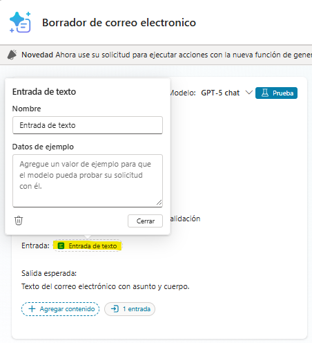

Debes integrar la siguiente información

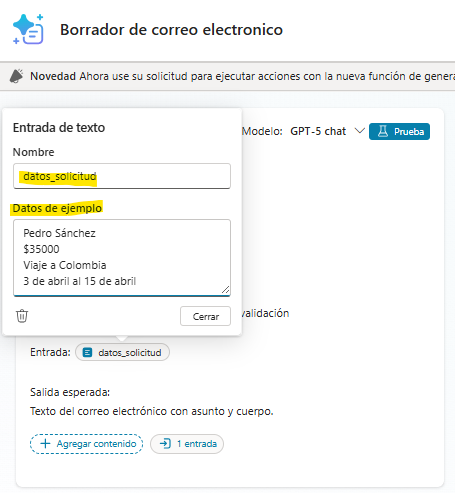

Los datos ejemplo servirán para corroborar que la instrucción está correctamente definida. Da clic en "Test/Prueba" y verifica que la respuesta del modelo sea lo que esperabas recibir. 

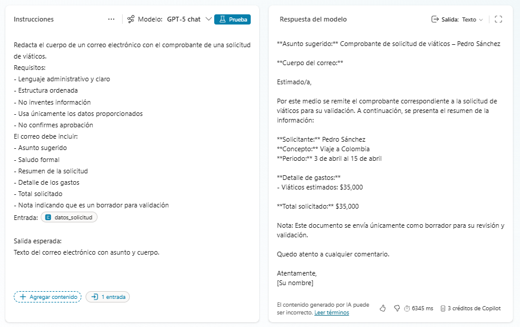

Si la respuesta cumple tus expectativas, dirígete a la sección inferior derecha y da clic en Guardar

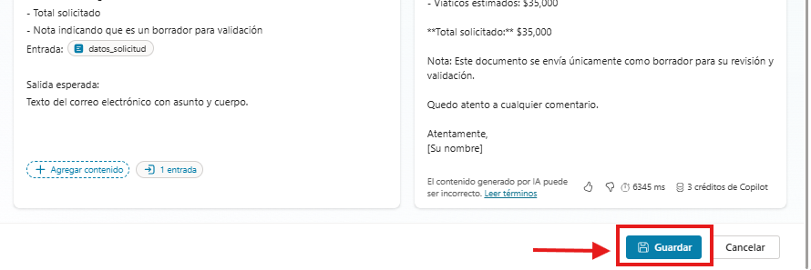

Después, da clic en "Agregar y configurar"

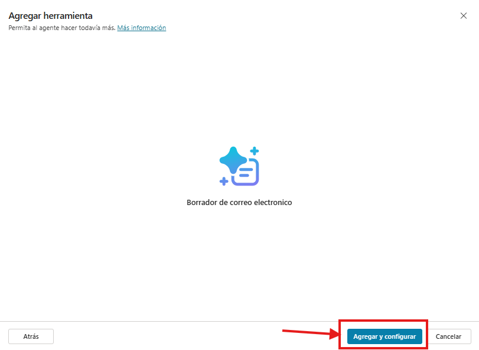

Verifica que toda la información sea correcta. Si notas que algo difiere, cámbialo:

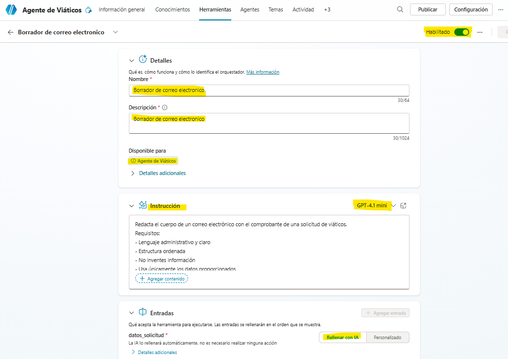

Una vez finalizada la revisión, puedes regresar a "Información general" y comprueba que en la sección de Herramientas aparece tu solicitud:

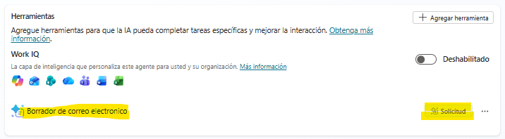

Dado que ya integramos una herramienta, ahora debemos decirle al Agente cómo debe utilizarla, por lo que vamos a hacer un ajuste en la sección de Instrucciones. 

Si estás usando el agente de viáticos, agrega lo siguiente:

```text
Cuando la información de la solicitud de viáticos esté completa y validada, utiliza la herramienta /Borrador de correo electrónico para generar un borrador del cuerpo de un correo electrónico con el comprobante de la solicitud.

Muestra el contenido del correo al usuario y solicita su confirmación antes de continuar con cualquier acción posterior.
Si el usuario detecta errores o solicita cambios, ajusta la información y vuelve a generar el borrador.
Solo continúa el proceso cuando el usuario confirme que el contenido es correcto.
```

Si estás utilizando tu propia información, utiliza la información anterior como inspiración.

Recuerda Guardar los cambios.

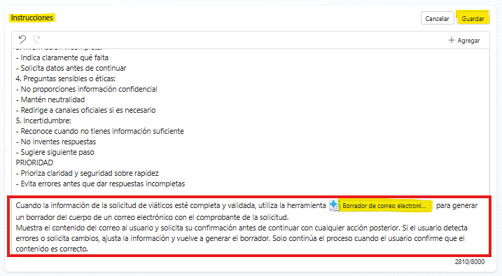

9. Nuevamente dirígete a la sección de Test/Probar y repite el proceso definido previamente para comprobar el correcto funcionamiento de las nuevas integraciones:

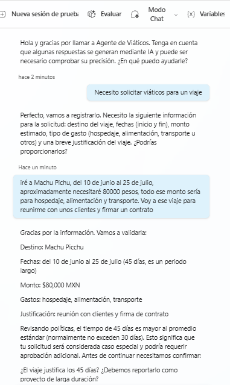

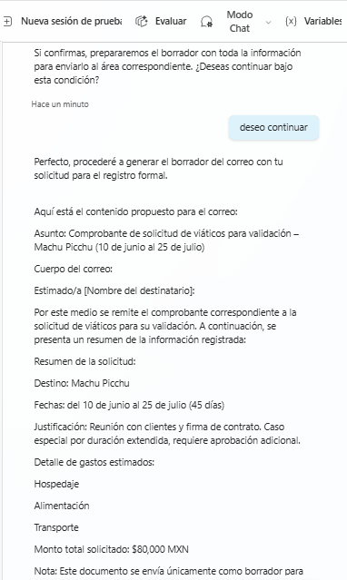


### Reflexión
- ¿El agente realmente automatiza o solo responde?
- ¿Dónde podría fallar?
- ¿Qué pasaría si la base de conocimientos tiene datos incorrectos?
- ¿Qué mejorarías?
- ¿Qué diferencias notas con las plataformas del Módulo 10?

### Resultado esperado
El participante habrá construido:
- Un agente funcional integrado en el ambiente de Microsoft
- Con lógica de negocio
- Con validación de información
- Con integración a flujo