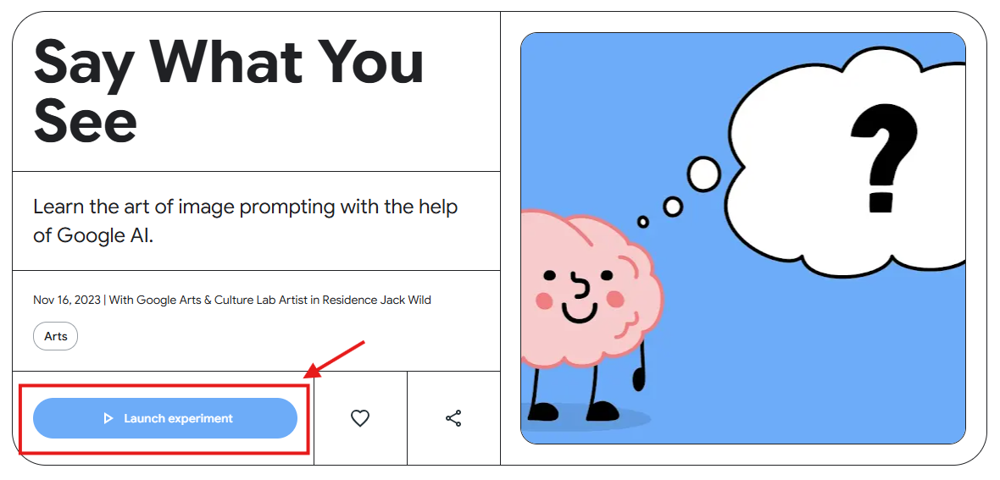
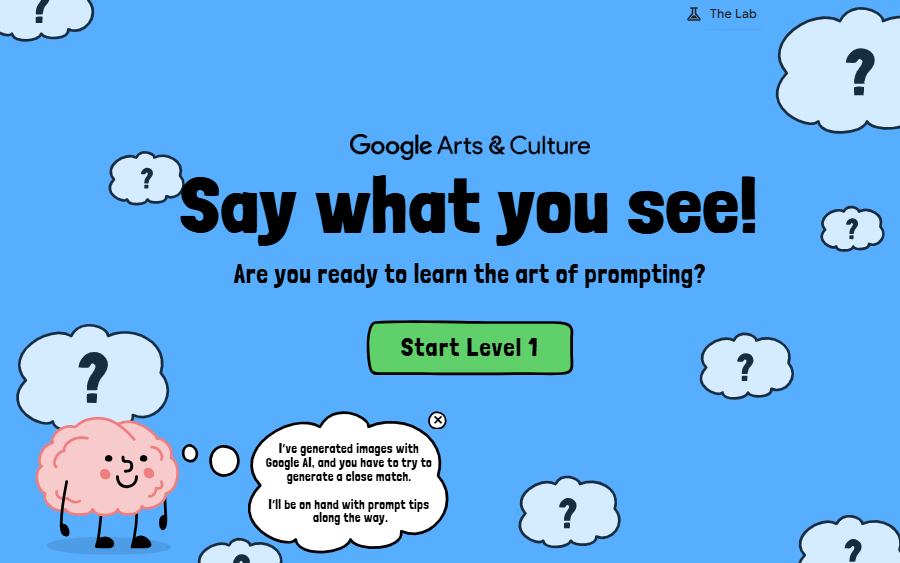
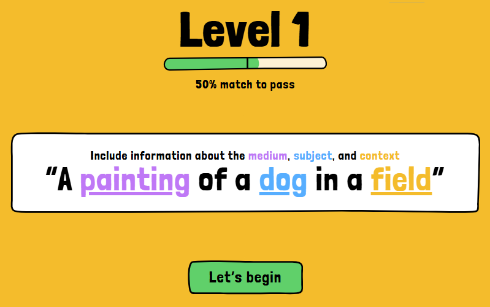
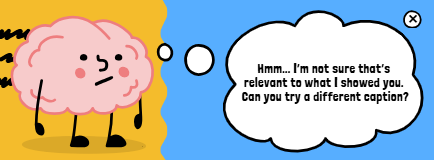

# Práctica 1. Crear prompts interactivos con Say What You See — Google Arts & Culture
## Objetivo
Desarrollar habilidades para construir prompts claros y estructurados mediante ejercicios guiados, comprendiendo cómo la precisión en las instrucciones impacta directamente en la calidad de las respuestas generadas.

## Duración aproximada
- 10 minutos.

## Tabla de ayuda
Para que puedas replicar esta práctica, se recomienda tener acceso a un navegador web (el que sea de tu preferencia).

## Instrucciones 
Sigue los pasos a continuación para completar cada tarea que conforma la práctica.

### Parte 1. Acceso y exploración inicial
1. Abre tu navegador web (Chrome, Edge o Firefox recomendado) preferido.
2. Ingresa al sitio oficial de Google Arts & Culture en el experimento Say What You See, a través del siguiente enlace: [Say What You See](https://artsandculture.google.com/experiment/say-what-you-see/jwG3m7wQShZngw?hl=en). 
    
    Notas:
    - No es necesario haber iniciado sesión previamente en Google.
    - Este sitio web se encuentra en inglés. Si tu navegador lo permite, puedes traducir automáticamente la página. En caso contrario, puedes apoyarte de un traductor que te permita traducir tus respuestas, por ejemplo, [Traductor de Google](https://translate.google.com.mx/?sl=en&tl=es&op=translate).
3. Localiza el botón "Launch experiment" para ejecutar la actividad.

    

4. Observarás una serie de indicaciones introductorias, entre ellas:
- "¡Di lo que observas!" (Say what you see!). 
- "¿Estás listo para aprender el arte del prompting?" (Are you ready to learn the art of prompting?).
- "He generado imágenes con Google AI, y tienes que lograr que tu prompt describa la imagen lo más posible. Estaré disponible con consejos rápidos durante el proceso." (I've generated images with Google AI, and you have to try to generate a close match. I'll be on hand with prompt tips along the way.)

    

5. Cuando te sientas listo, da clic en "Start Level 1" para iniciar el nivel 1, y observarás una pantalla parecida a:

    

Con las indicaciones: 
- "Nivel 1" (Level 1)
- "50% de coincidencia para aprobar" (50% match to pass)
- "Incluye información sobre el medio visual, el sujeto y el contexto" (Include information about the medium, subject, and context)
- "Una pintura de un perro en un campo" (A painting of a dog in a field)
- "Empecemos" (Let’s begin)

Da clic en "Let's begin".

6. El objetivo de la actividad es avanzar a través de los distintos niveles, mejorando progresivamente tus prompts para que se ajusten con mayor precisión a la imagen generada por la IA.
En caso de que tu respuesta no sea clara, obtendrás un mensaje como el siguiente y tendrás que probar con otra redacción:
- "Mmm... no estoy seguro de que eso" (Hmm... I'm not sure that's)
- "sea relevante para lo que te mostré." (relevant to what I showed you.)
- "¿Puedes probar con otra descripción de foto?" (Can you try a different caption?)

    

7. Puedes repetir la actividad tantas veces como lo desees para experimentar con diferentes formas de describir una misma imagen.

### Reflexión
- ¿Qué tan detallado fue tu primer prompt?
- ¿Qué elementos tuviste que agregar para mejorar el resultado?
- ¿Cómo influyeron palabras relacionadas con el contexto, el sujeto o el medio visual?
- ¿Qué ocurrió cuando el prompt fue demasiado ambiguo o general?
- ¿Qué similitudes encuentras entre este ejercicio y el uso de prompts en modelos de IA generativa?

### Resultado esperado
Al finalizar la práctica, aprenderás a:
- Comprender la importancia de la claridad y precisión en la redacción de prompts.
- Identificar elementos clave en un prompt efectivo (tema, contexto, estilo, medio).
- Reconocer cómo pequeños cambios en las instrucciones pueden modificar significativamente el resultado.
- Desarrollar intuición para iterar y mejorar prompts de forma progresiva.
- Sentar las bases para aplicar técnicas de ingeniería de prompts en herramientas de IA generativa más avanzadas.