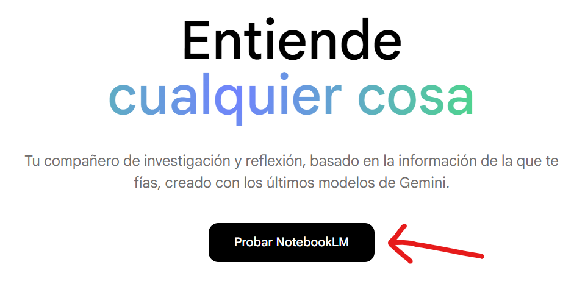
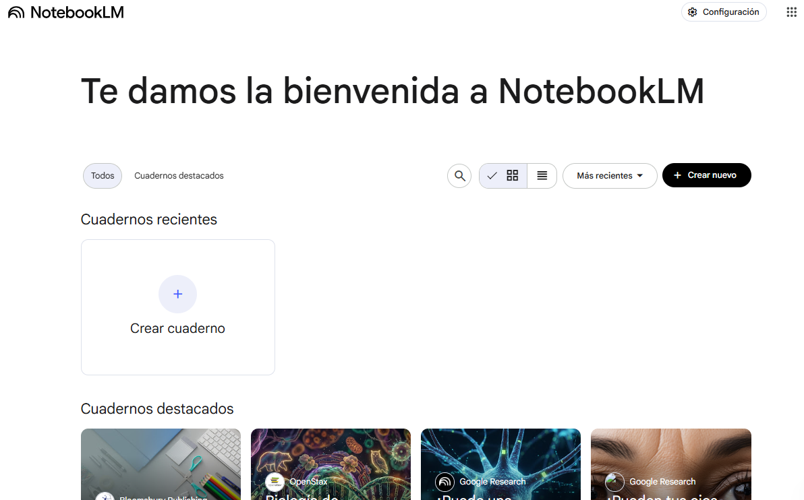
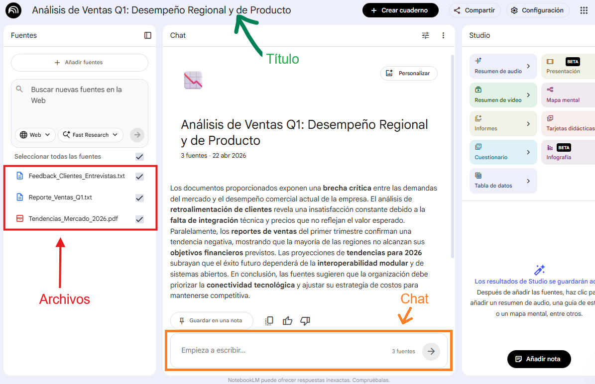
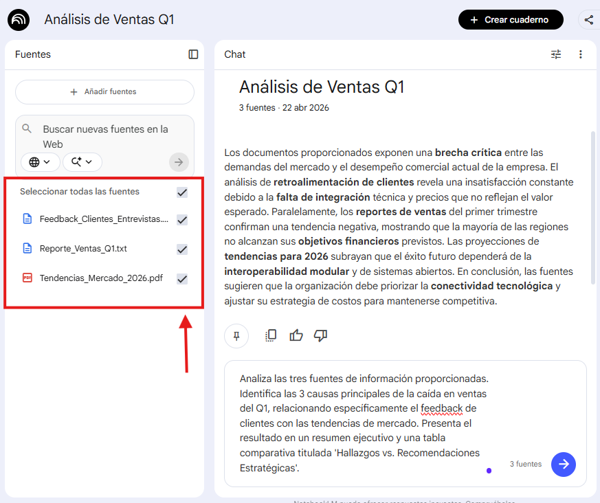
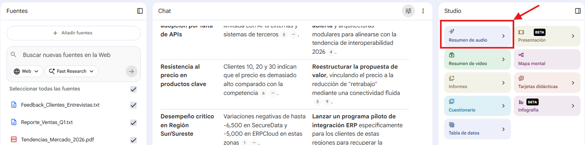
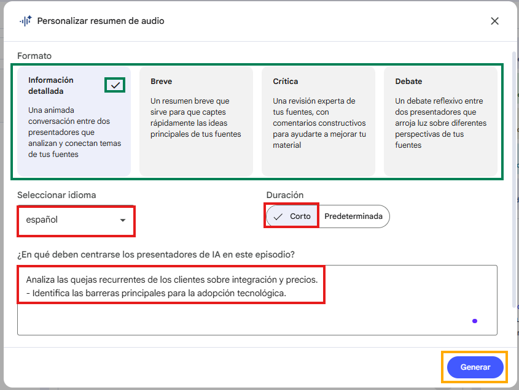
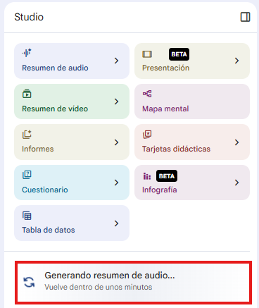
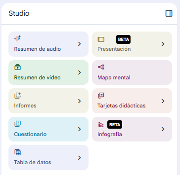

# Práctica 1. Sintetizar información con NotebookLM
## Objetivos
Utilizar herramientas de IA para consolidar múltiples fuentes de información en resúmenes claros y estructurados, facilitando la comprensión y el aprovechamiento del conocimiento organizacional.

## Duración aproximada
- 15 minutos.

## Tabla de ayuda
Para que puedas replicar esta práctica, se recomienda tener una cuenta en:

| Sitio web | Enlace |
| --- | --- | 
| NotebookLM| https://notebooklm.google/ |

## Instrucciones 
Sigue los pasos a continuación para completar cada tarea que conforma la práctica.

## Contexto de la práctica

### Parte 1. Análisis y Síntesis Estratégica

1. Descarga los archivos de la carpeta: [archivos](../images/M7/P1/)
2. Accede a NotebookLM y da clic en "Probar NotebookLM"



Coloca tu correo electrónico asociado a la cuenta de google que se te asignó y crea una cuenta. Finaliza los pasos siguientes, y al finalizar, podrás observar lo siguiente:



3. Da clic en "Crear cuaderno" e integra los 3 archivos que descargaste. Una vez integrados, observarás algo parecido a lo siguiente:



Puedes modificar el título si así lo deseas. Podrías llamarlo "Análisis de Ventas Q1".

2. En la sección de chat, escribe el siguiente prompt:

```text
Analiza las tres fuentes de información proporcionadas. Identifica las 3 causas principales de la caída en ventas del Q1, relacionando específicamente el feedback de clientes con las tendencias de mercado. Presenta el resultado en un resumen ejecutivo y una tabla comparativa titulada 'Hallazgos vs. Recomendaciones Estratégicas'.
```

Antes de enviar tu prompt, verifica que las 3 fuentes de información están seleccionadas.



3. Analiza la respuesta

- ¿Logró la IA conectar los puntos entre el precio alto y la falta de integración con la tendencia del mercado?

### Parte 2. Transformación a formato Audiovisual
NotebookLM permite generar un Resumen de audio. 

1. En la sección derecha, busca la opción de "Resumen de audio" y da clic.



2. Selecciona el formato que desees. 
3. Elige el idioma español 
4. Elige una duración corta
5. En la sección "¿En qué deben centrarse los presentadores de IA en este episodio?" escribe:

```text
Analiza las quejas recurrentes de los clientes sobre integración y precios.
- Identifica las barreras principales para la adopción tecnológica.
```



5. Da clic en "Generar" y espera unos minutos a que la herramienta genere el podcast.



Escucha el audio resultante.

6. Reflexiona:

- ¿Qué tan preciso es el tono y el análisis frente a los documentos originales?
- ¿Cómo facilita este formato la comunicación de resultados complejos ante perfiles ejecutivos o directivos que no tienen tiempo de leer un reporte extenso?


### Parte 3. Ingeniería de Escenarios y Plan de Acción
Utiliza el conocimiento consolidado en el Notebook para ejecutar un plan táctico. 

1. Escribe el siguiente prompt:

```text
Basado en los hallazgos anteriores, crea un plan de acción de 4 semanas para el equipo comercial. 
Define: 
1. Objetivos específicos por semana. 
2. Argumentos clave de venta para contrarrestar la objeción de precio. 
3. Un correo electrónico persuasivo para clientes que abandonaron la marca, aplicando los conceptos de 'interoperabilidad' del reporte de tendencias.
Asegúrate de que el plan sea realista y profesional.
```

2. Evalúa la respuesta:
- ¿La IA creó contenido nuevo y coherente que no estaba explícitamente en los archivos, pero que se infiere correctamente de ellos?


### Parte 4. Exploración individual

1. Explora las capacidades que consideres interesantes y que puedan apoyarte en tus actividades diarias.



### Reflexión
- ¿Cómo cambió tu perspectiva sobre el "análisis de documentos" al observar la capacidad de conectar datos dispersos?
- ¿Por qué es más eficiente trabajar con un "cuaderno" de fuentes restringidas en NotebookLM que buscar información en una IA genérica abierta?
- ¿Qué impacto tiene la posibilidad de generar un podcast sobre tus documentos para el trabajo colaborativo?


### Resultado esperado
Al finalizar esta práctica, el participante será capaz de:
- Cargar y estructurar múltiples fuentes de información en un entorno de conocimiento cerrado.
- Sintetizar información compleja en formatos ejecutivos (tablas y resúmenes).
- Utilizar la generación de audio para presentar resúmenes ejecutivos.
- Diseñar estrategias a partir de evidencia, manteniendo la coherencia con el contexto de los documentos fuente.

