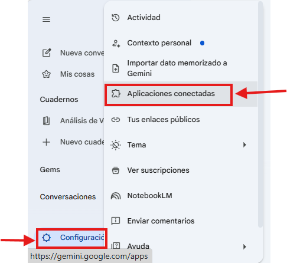
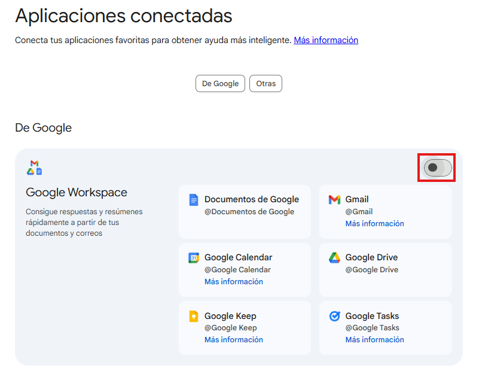
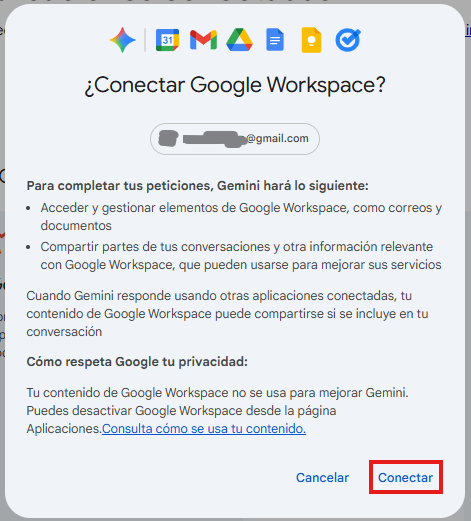

# Práctica 2. Orquestar información en Gemini App
## Objetivos
Aplicar capacidades de IA para integrar y recuperar información dispersa, automatizando procesos administrativos y mejorando la eficiencia en la gestión de datos.

## Duración aproximada
- 15 minutos.

## Tabla de ayuda
Para que puedas replicar esta práctica, se recomienda tener una cuenta en la siguiente plataformas:

| Sitio web | Enlace |
| --- | --- | 
| Gemini | https://gemini.google.com/app?hl=es |

## Instrucciones 
Sigue los pasos a continuación para completar cada tarea que conforma la práctica.

## Contexto de la práctica
Ejerces el rol de Analista de Operaciones Financieras en una empresa de Logística Aeroespacial. Tu trabajo consiste en asegurar que los contratos de transporte de piezas críticas coincidan con los pagos recibidos. Actualmente, enfrentas un conflicto administrativo: un proveedor clave reclama un impago, pero la información sobre las tarifas pactadas, las facturas enviadas y las confirmaciones de recepción están dispersas entre hilos de correo electrónico y carpetas compartidas de Drive. Tu meta es consolidar estos datos en segundos para dar una respuesta definitiva.

### Parte 1. Conexión con Google Workspace
1. Ingresa a Gemini y dirígete a "Configuración y Ayuda" (ícono de engranaje). 
2. Da clic en "Aplicaciones conectadas".



3. Identifica la sección de Google Workspace y actívalo:



4. Al observar la siguiente ventana da clic en "Conectar":



5. Crea una nueva conversación. 

### Parte 2. Recuperación y Orquestación de Datos Dispersos
En esta etapa, Gemini debe actuar como un puente entre tus aplicaciones para extraer la "verdad" de los datos.

1. Ejecuta el siguiente prompt de recuperación cruzada:

```text
@Gmail y @Google Drive busquen toda la información relacionada con el proveedor "AeroEnvios". 
Necesito recuperar:
1. El "Contrato de Tarifas 2026" (documento en Drive).
2. El hilo de correos más reciente donde se discuta la "Factura AE-990".
3. La confirmación de entrega de la pieza "Turbina X-1" que debería estar en un PDF o correo.

Dame un resumen de qué dice cada fuente encontrada.
```

Antes de enviar el prompt, asegúrate de que "@Gmail" y "@Google Drive" aparezcan en Bold (o negritas):


### Parte 3. Consolidación Financiera Automática
Una vez que Gemini ha localizado las fuentes, el siguiente paso es tabular los datos para identificar la raíz del conflicto.

1. Escribe el siguiente prompt para procesar los hallazgos:

```text
Basado en la información que acabas de encontrar, genera una tabla de consolidación financiera que incluya:
- Concepto (Descripción de la pieza o servicio).
- Tarifa según Contrato (de Drive).
- Monto cobrado en la Factura AE-990 (de Gmail).
- Diferencia numérica.
- Estatus de entrega (si hay evidencia en los correos).

Identifica si existe alguna discrepancia entre lo pactado y lo facturado.
```

Podrías recibir una respuesta parecida a:


### Parte 4. Resolución de Conflicto Administrativo
Automatizarás la respuesta profesional basada en la evidencia encontrada.

1. Escribe el siguiente prompt de resolución:

```text
Como Analista de Operaciones Financieras, redacta una respuesta formal para el representante de "AeroEnvios". 
- Si encontraste una discrepancia, solicita la corrección de la factura citando el contrato. 
- Si los datos coinciden, explica que el pago está en proceso de validación final. 
- Incluye los nombres de los archivos y las fechas de los correos que consultamos como evidencia de soporte.
```

### Reflexión
- ¿Cómo cambia tu flujo de trabajo el hecho de no tener que saltar entre pestañas de Gmail y Drive para comparar datos?
- ¿Qué tan preciso fue Gemini al extraer montos específicos de los archivos y correos encontrados?
- ¿De qué manera esta "orquestación" reduce el error humano en la captura de datos financieros?

### Resultado esperado
Al finalizar, el participante habrá logrado:
- Configurar un entorno de IA interconectado con sus herramientas de productividad.
- Consolidar una tabla financiera sin abrir manualmente ningún documento.
- Generar una comunicación de resolución de conflictos basada 100% en evidencia documental recuperada por la IA.


