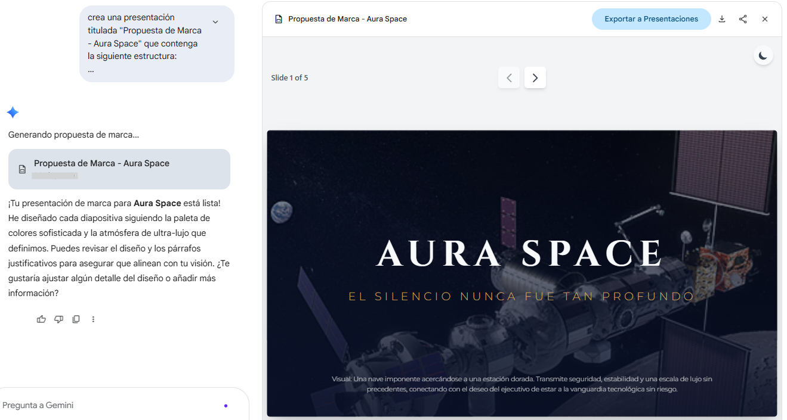

# Práctica 3. Generar activos visuales con IA
## Objetivos
Crear materiales visuales de alta calidad mediante herramientas de IA, optimizando la comunicación de ideas y la generación de contenido para presentaciones corporativas.

## Duración aproximada
- 15 minutos.

## Tabla de ayuda
Para que puedas replicar esta práctica, se recomienda tener una cuenta en la siguiente plataforma:

| Sitio web | Enlace |
| --- | --- | 
| Gemini | https://gemini.google.com/app?hl=es |

## Instrucciones 
Sigue los pasos a continuación para completar cada tarea que conforma la práctica.


## Contexto de la práctica
Ejerces el rol de Director Creativo en una agencia de Marketing boutique. Han ganado la cuenta de "Aura Space", una nueva empresa de turismo espacial que busca democratizar el lujo en la órbita terrestre. Tu misión es liderar el ciclo de creación de la marca desde cero: definir su ADN visual, crear el contenido publicitario para diferentes canales y presentar la propuesta final de identidad ante los inversionistas de Aura Space.

### Parte 1. Consultoría y ADN de Marca
En esta fase, Gemini actuará como tu estratega de marca.

1. Inicia un nuevo chat y proporciona el concepto base:

```text
Estamos creando la marca "Aura Space", una startup de turismo espacial de ultra-lujo. 
Público objetivo: Ejecutivos de alto nivel y entusiastas del diseño que buscan exclusividad.
Ayúdame a definir:
1. Una paleta de colores sofisticada (nombres y códigos de color sugeridos).
2. El concepto de "Atmósfera Visual" (iluminación, materiales, texturas).
3. 3 Elementos obligatorios que deben aparecer en nuestra publicidad para ser reconocibles.
4. Un Slogan potente y elegante.
```

### Parte 2. Producción de Activos Publicitarios 
Ahora, utilizarás las definiciones de la Parte 1 para generar imágenes específicas para diferentes medios. Importante: Debes pedirle a Gemini que respete la coherencia de marca en cada imagen generada. 

1. Para Redes Sociales (Instagram). Envía el siguiente prompt:

```text
Basado en la identidad de Aura Space, genera una imagen para Instagram. Debe mostrar a una pareja joven de lujo brindando con copas de cristal fino frente a una ventana curva con la Tierra de fondo. Iluminación cálida, estilo minimalista y elegante.
```

2. Para Espectacular (Vía Pública). Envía el siguiente prompt:

```text
Genera una imagen cinematográfica en formato horizontal para un espectacular. Debe mostrar la nave de Aura Space acercándose a una estación espacial dorada y blanca. Debe verse imponente, lujosa y transmitir seguridad absoluta.
```

3. Para Revista Retail (Lifestyle). Envía el siguiente prompt:

```text
Genera una imagen fotorrealista de primer plano (close-up) de un reloj de pulsera edición especial "Aura Space" colocado sobre una mesa de mármol dentro de la nave. Se deben ver reflejos de las estrellas en el cristal del reloj.
```

4. Para el Menú de la Cena. Envía el siguiente prompt:

```text
Genera una imagen de un postre molecular diseñado para Aura Space, servido en un plato de cerámica artesanal con detalles dorados. La presentación debe parecer arte moderno.
```

Observa las diferencias en las imágenes generadas:

- ¿Consideras que la composición de cada imagen se adapta al canal solicitado? (Ej: ¿Es el espectacular lo suficientemente impactante y claro a gran escala? ¿Tiene la imagen de redes sociales el estilo aspiracional adecuado?).
- ¿Cada imagen respeta los elementos obligatorios y la atmósfera visual que definiste en la Parte 1?
- Si pusieras las cuatro imágenes juntas, ¿un cliente podría identificar que pertenecen a la misma marca, o alguna parece "fuera de lugar"?

### Parte 3. Integración y Presentación de Propuesta
Finalmente, consolidarás todo el ciclo creativo en un entregable profesional.

1. Solicita a Gemini crear una presentación titulada "Propuesta de Marca - Aura Space" que contenga la siguiente estructura:

- Slide 1 (Portada): Imagen del espectacular + Slogan.
- Slide 2 (Identidad): Desglose de la paleta de colores y atmósfera visual.
- Slide 3 (Campañas): Muestra de los activos para redes sociales y revista.
- Slide 4 (Experiencia): Imagen del menú y descripción del servicio.

Pide a Gemini que redacte un breve párrafo explicativo para cada diapositiva que justifique por qué esos visuales conectan con el público objetivo y que mantenga el diseño propuesto.

### Consejo de Quota: Dado que esta práctica requiere al menos 4 generaciones de imágenes, cuida tus intentos de "Refinar" para no exceder los 20 usos diarios gratuitos de Nano Banana.

Una vez generada la respuesta, verifica que cumpla con los requerimientos definidos. Solicita las mosificaciones necesarias.

El resultado final puede parecerse al mostrado a continuación:



### Reflexión

- ¿Cómo cambió el resultado final al pedirle primero a la IA que definiera la estrategia de marca antes de generar las imágenes?
- ¿Qué tan difícil fue mantener la coherencia visual entre los diferentes canales (redes, espectacular, revista)?
- ¿De qué manera este flujo de trabajo acelera el "Time-to-Market" de una nueva marca o campaña?

### Resultado esperado

Al finalizar, el participante habrá completado un ciclo creativo real:
- Una Guía de Estilo conceptual creada por IA.
- Un Pool de Activos (4 imágenes) listos para diferentes canales de comunicación.
- Una Presentación Ejecutiva en Google Slides que vende la visión de la marca Aura Space de forma coherente y profesional.