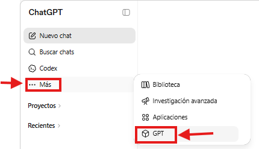
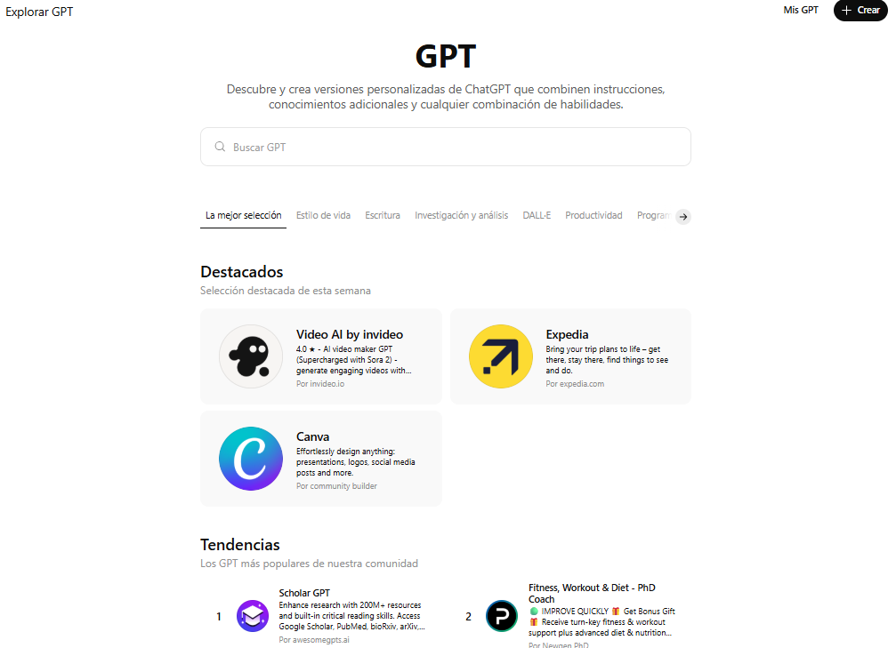
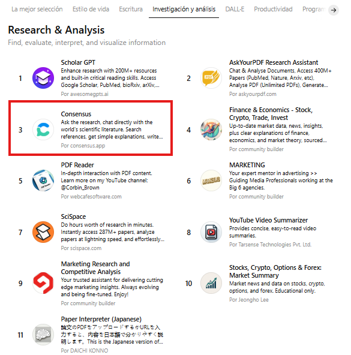
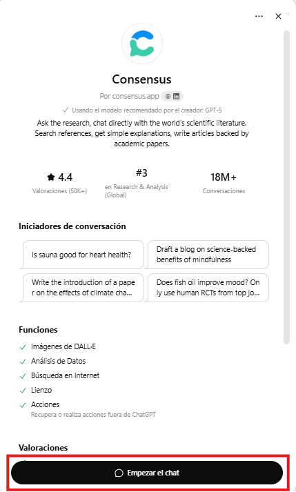
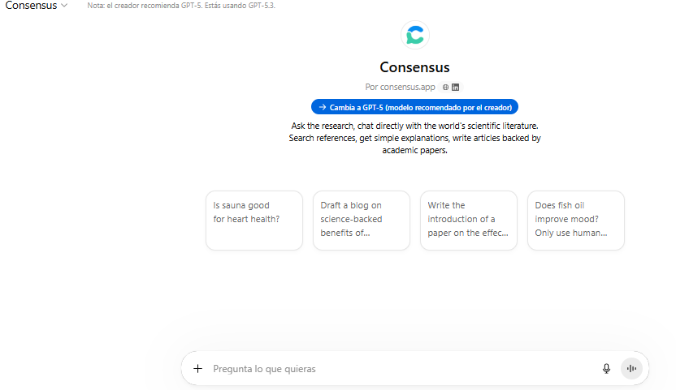
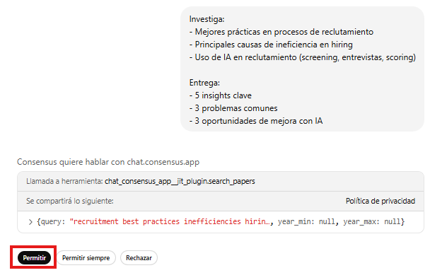
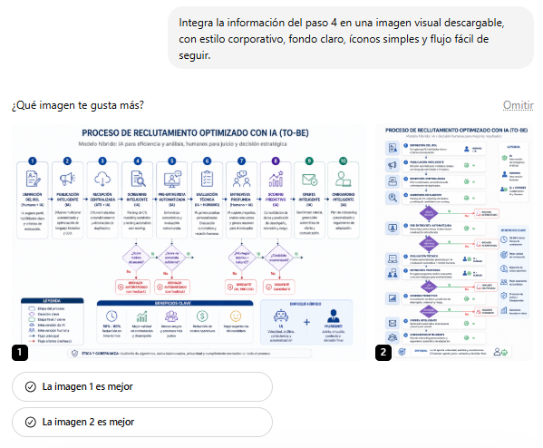

# Práctica 2. Exploración de GPT's en GPT Store
## Objetivos
Utilizar distintos GPTs del ecosistema para investigar, rediseñar y visualizar un proceso de reclutamiento, integrando el uso de tecnología (IA) para mejorar eficiencia, tiempos y calidad de contratación.

## Duración aproximada
- 15 minutos.

## Tabla de ayuda
Para que puedas replicar esta práctica, se recomienda tener una cuenta en la siguiente plataforma:

| Sitio web | Enlace |
| --- | --- | 
| ChatGPT | https://auth.openai.com/create-account | 

## Instrucciones 
Sigue los pasos a continuación para completar cada tarea que conforma la práctica.


## Contexto de la práctica
Formas parte del equipo de Transformación Digital en el área de Recursos Humanos de una organización.

Actualmente, el proceso de reclutamiento presenta los siguientes problemas:
- Procesos lentos
- Pérdida de candidatos en etapas intermedias
- Falta de estandarización
- Evaluación poco consistente

La dirección está evaluando integrar Inteligencia Artificial, pero no tiene claridad sobre:
- En qué etapas aplicarla
- Qué impacto tendría
- Cómo cambiaría el proceso actual

Utilizarás distintos GPTs del ecosistema para investigar mejores prácticas, rediseñar el proceso, visualizar el flujo y evaluar impacto en el negocio.

### Parte 1. Investigación (Research GPT)
En esta etapa utilizarás un GPT especializado en investigación.

1. Ingresa a ChatGPT. En la barra lateral izquierda, da clic en "... Más" y después clic en "GPT".



Observarás la siguiente pantalla:



2. Da clic en "Investigación y análisis"



Selecciona el GPT "Consensus".

Observarás una pantalla como la siguiente:



Da clic en "Empezar el chat" y serás redirigido a otra pantalla donde podrás interactuar con el GPT.



3. Utiliza el siguiente prompt:

```text
Investiga:
- Mejores prácticas en procesos de reclutamiento
- Principales causas de ineficiencia en hiring
- Uso de IA en reclutamiento (screening, entrevistas, scoring)

Entrega:
- 5 insights clave
- 3 problemas comunes
- 3 oportunidades de mejora con IA
```

En caso de recibir el siguiente mensaje, da clic en Permitir:



4. Analiza la respuesta:
- ¿Los insights son relevantes?
- ¿Están bien fundamentados? Verifica la información en las fuentes citadas.
- ¿Son aplicables en un contexto real?

### Parte 2. Rediseño del proceso (ChatGPT)
Ahora utilizarás ChatGPT para rediseñar el proceso.

1. Las conversaciones en los GPTs no se guardan, por lo que deberás copiar la respuesta generada y pegarla en un canva (lienzo) en una nueva conversación. 

2. Envía el siguiente prompt:

```text
Actúa como consultor en Recursos Humanos.
Con base en la investigación previa:

1. Rediseña el proceso de reclutamiento
2. Integra IA en etapas específicas (ej: filtrado de CV, entrevistas iniciales, scoring)
3. Explica brevemente cada etapa
```

3. Después, envía el siguiente prompt:

```text
Indica:

- Beneficios esperados del nuevo proceso
- Riesgos potenciales (ej: sesgos, dependencia tecnológica)
```

4. Analiza la respuesta:
- ¿El proceso es claro?
- ¿La integración de la IA en el proceso es lógica?
- ¿Los riesgos son realistas?

5. Mantén esta información, ya que se utilizará en el siguiente paso.

### Parte 3. Visualización del proceso (Diagrams GPT)
En esta etapa visualizarás el flujo del proceso utilizando únicamente ChatGPT.

1. En la misma conversación que generaste anteriormente, utiliza el siguiente prompt:

```text
A partir de la información generada previamente:

1. Genera una representación clara del flujo del proceso para:
   - Proceso actual (AS-IS)
   - Proceso optimizado con IA (TO-BE)

Debe incluir:
- Etapas del proceso en orden
- Decisiones clave (indicando condiciones)
- Puntos donde se integra la IA

2. Estructura el flujo de manera visual y fácil de seguir (usa formato tipo esquema, indentación o numeración clara).

3. Genera una tabla comparativa que incluya:
- Etapa
- Problema actual
- Mejora con IA
- Impacto esperado

4. Genera una imagen estilo infografía profesional que represente el proceso optimizado (TO-BE), mostrando:
- Etapas principales
- Decisiones clave
- Uso de IA

La imagen debe ser clara, visualmente atractiva y adecuada para presentarse a nivel directivo.
```

2. Analiza la respuesta:
- ¿El flujo es claro y lógico?
- ¿Se identifican claramente las decisiones?
- ¿La integración de IA es visible?
- ¿La tabla facilita la comprensión del cambio?
- ¿La imagen comunica claramente el proceso?

3. Si no se generó la imagen, solicita nuevamente la generación, por ejemplo:

```text
Integra la información del paso 4 en una imagen visual descargable, con estilo corporativo, fondo claro, íconos simples y flujo fácil de seguir.
```

Podrías recibir algo parecido a:



### Parte 4. Cierre estratégico
Ahora consolidarás el análisis.

1. Utiliza el siguiente prompt:

```text
Actúa como consultor estratégico.

Con base en todo el análisis previo (investigación, rediseño del proceso y visualización), genera un entregable ejecutivo dirigido a alta dirección.

Incluye:

1. Resumen ejecutivo:
- Máximo 5 bullets
- Enfocado en los hallazgos más relevantes

2. Principales mejoras logradas:
- Cambios clave del proceso
- Diferencias entre el modelo actual y el optimizado

3. Impacto en negocio:
- Tiempo (reducción de tiempos de contratación)
- Calidad (mejor selección de candidatos)
- Eficiencia (automatización y reducción de carga operativa)

4. Riesgos y consideraciones:
- Posibles sesgos en IA
- Dependencia tecnológica
- Retos de implementación organizacional

5. Recomendación final:
- Si se debería implementar o no
- Bajo qué condiciones
- Primeros pasos sugeridos
```

2. Analiza la respuesta:
- ¿Es clara para un directivo?
- ¿Está enfocada en negocio?
- ¿Resume correctamente el trabajo realizado?

### Reflexión
- ¿En qué parte del proceso la IA aporta mayor valor?
- ¿Dónde identificas mayores riesgos?
- ¿El GPT te pareció útil a comparación de otras herramientas?
- ¿Qué diferencias observaste entre los GPTs?

### Resultado esperado
Al finalizar la práctica, el participante será capaz de:
- Investigar utilizando GPTs especializados en conocimiento.
- Rediseñar procesos integrando Inteligencia Artificial.
- Identificar oportunidades de automatización en reclutamiento.
- Visualizar procesos mediante herramientas de diagramación.
