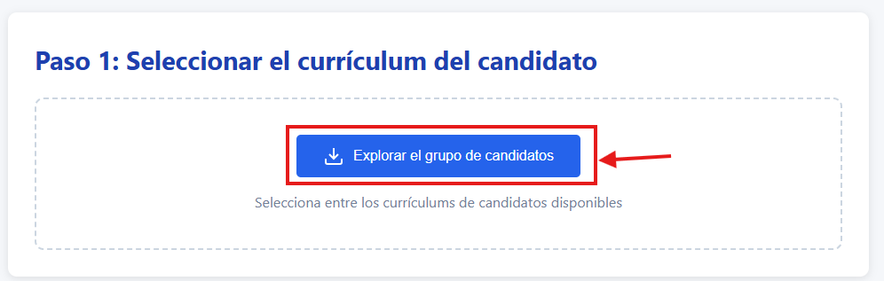
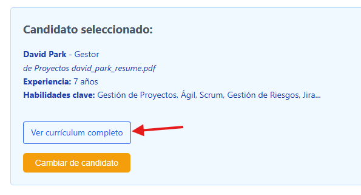
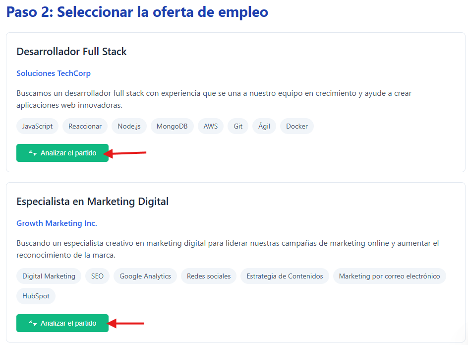

# Práctica 1. Explorar soluciones basadas en agentes
## Objetivos
Explorar ejemplos reales de agentes de IA para comprender su aplicación en procesos organizacionales y su impacto en la automatización de tareas.

## Duración aproximada
- 6 minutos.

## Tabla de ayuda
Para que puedas replicar esta práctica solo necesitas tener acceso a un explorador web.

## Instrucciones 
Sigue los pasos a continuación para completar cada tarea que conforma la práctica.

### Parte 1. Acceso y exploración inicial
1. Abre tu explorador web (Chrome, Edge o Firefox recomendado) preferido.
2. Ingresa al sitio: [RecruiterDashboard](https://microsoftlearning.github.io/mslearn-ai-sims/sims/resume_app/). 
3. Explora la interfaz del sistema:
- ¿Qué tipo de información solicita?
- ¿Qué proceso parece estar simulando?
4. Interactúa con la herramienta en el Paso 1:

Selecciona el candidato que consideres más interesante.

5. Analiza el comportamiento del agente y explora los resultados generados.

- Puedes observar el currículum completo de cada candidato:

- En el Paso 2 da clic en el botón de "Analizar" para cada oferta y observa: 
    - ¿Qué tipo de recomendaciones genera?
    - ¿Qué tareas realiza sin intervención humana?

6. Identifica el proceso organizacional que está representando:
- ¿En qué etapa del reclutamiento se ubica?
- ¿Qué problema intenta resolver?

7. Reflexiona sobre la automatización:
- ¿Qué tareas están siendo reemplazadas o asistidas por IA?
- ¿Qué beneficios observas en términos de tiempo o eficiencia?

8. Modifica la información del paso 1 seleccionando otro candidato. 

### Reflexión

- ¿Qué diferencia observas entre este agente y una herramienta tradicional (por ejemplo, un sistema manual de revisión de CVs)?
- ¿Qué tareas específicas del proceso de reclutamiento podrían automatizarse con este tipo de soluciones?
- ¿Qué riesgos podrían existir al delegar decisiones a un agente de IA?
- ¿En qué áreas de tu trabajo podrías aplicar un agente similar?

### Resultado esperado
Al finalizar esta práctica, el participante será capaz de:
- Reconocer qué es un agente de IA y cómo opera dentro de un proceso
- Identificar tareas que pueden ser automatizadas mediante agentes
- Analizar el impacto de los agentes en eficiencia y productividad dentro de un entorno organizacional