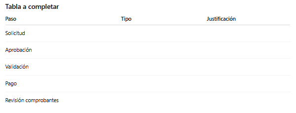
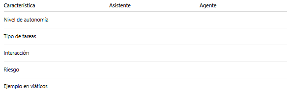

# Práctica 2. Diferenciar asistente vs agente
## Objetivos
Identificar las diferencias funcionales entre asistentes y agentes de IA, comprendiendo sus roles dentro de procesos automatizados y su nivel de autonomía.

## Duración aproximada
- 10 minutos.

## Tabla de ayuda
Para que puedas replicar esta práctica no necesitas ninguna herramienta mas que tu propia capacidad de análisis.

## Instrucciones 
Sigue los pasos a continuación para completar cada tarea que conforma la práctica.


## Contexto de la práctica
Trabajas en el área administrativa de una empresa.

El proceso de gestión de viáticos presenta problemas:
- Falta de claridad en solicitudes
- Errores en montos
- Validaciones manuales
- Retrasos en aprobación

Tu objetivo es analizar este proceso y definir:
- Qué partes corresponden a un asistente
- Qué partes corresponden a un agente
- Qué partes deben seguir siendo humanas

El proceso es el siguiente:

```text
PROCESO ACTUAL DE VIÁTICOS

1. El empleado solicita viáticos por correo
2. El jefe revisa y aprueba
3. Finanzas valida el monto
4. Se realiza el pago
5. El empleado entrega comprobantes
6. Finanzas revisa comprobantes
7. Se cierra el proceso

Problemas actuales:
- Correos incompletos
- Falta de claridad en montos
- Errores en comprobantes
- Retrasos en validación
```

1. Lee el proceso y responde:

- ¿Dónde hay ambigüedad?
- ¿Dónde hay errores humanos?
- ¿Qué pasos consumen más tiempo?

2. Define con tus propias palabras:

- ¿Qué es un asistente?

A partir de tu definición: 
- ¿Qué tipo de tareas puede hacer?
- ¿Qué NO debería hacer?

3. Define:

- ¿Qué es un agente?

A partir de tu definición: 
- ¿Qué tipo de decisiones puede tomar?
- ¿Qué tareas puede automatizar?

4. Clasifica cada paso del proceso en:

- Asistente
- Agente
- Humano

Y regístralo en una tabla parecida a la siguiente:



5. Completa la tabla comparando qué hace un asistente y qué hace un agente.

Usa estas ideas clave:
- Asistente: responde, explica, sugiere
- Agente: decide, ejecuta, automatiza



6. Propón un nuevo flujo donde:

- El asistente apoye
- El agente automatice
- El humano supervise

### Reflexión
- ¿Qué tareas nunca deberían automatizarse?
- ¿Dónde es peligroso usar un agente?
- ¿Qué errores podrían ocurrir si no se controla bien?
- ¿Qué beneficios aporta cada uno?


### Resultado esperado
Al finalizar, el participante debe:
- Entender claramente la diferencia entre asistente y agente
- Aplicarlo a un proceso real
- Identificar oportunidades de automatización
- Diseñar un flujo más eficiente