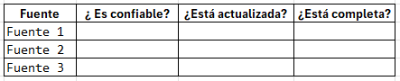

# Práctica 5. Gestionar fuentes de conocimiento
## Objetivos
Seleccionar, organizar y estructurar fuentes de información que alimenten a un agente, asegurando la calidad, precisión y actualización de sus respuestas.

## Duración aproximada
- 10 minutos.

## Tabla de ayuda
Para que puedas replicar esta práctica, se recomienda tener una cuenta en cualquiera de las siguientes plataformas:

| Sitio web | Enlace |
| --- | --- | 
| ChatGPT | https://auth.openai.com/create-account | 
| Copilot | https://copilot.microsoft.com/login o https://m365.cloud.microsoft/ |
| Gemini | https://gemini.google.com/app?hl=es |

## Instrucciones 
Sigue los pasos a continuación para completar cada tarea que conforma la práctica.


## Contexto de la práctica
Ahora debes resolver lo más importante:

¿De dónde obtiene su conocimiento el agente?

Un mal diseño aquí provoca:
- Respuestas incorrectas
- Información desactualizada
- Alucinaciones

### Parte 1. Validar acceso y anonimización de la información

1. Recupera la información que definiste previamente y responde:
- ¿Tienes acceso real a la información que necesita el agente para actuar de forma correcta?
- ¿Dónde se encuentra (documentos, sistemas, bases de datos)?
- ¿Contiene datos sensibles o personales?
- ¿Está anonimizada o protegida?

Si la información no está protegida, el agente puede:
- Exponer datos sensibles
- Generar riesgos legales
- Dar respuestas indebidas

2. Identifica fuentes de información:

- Define al menos 3 fuentes:
    - Fuente 1:
    - Fuente 2:
    - Fuente 3:

¿Esas fuentes son confiables y relevantes para el agente?

3. Evalúa la calidad de las fuentes:



4. Define la estructura del conocimiento

Define cómo organizarás la información:
- Por categorías
- Por tipo de problema
- Por prioridad

Una pregunta importante a responder es:
- ¿Cómo facilitarías que el agente encuentre la información correcta?

5. Define las reglas de uso del conocimiento

- ¿Qué debe hacer el agente si hay información contradictoria?
- ¿Qué debe hacer si falta información?
- ¿Qué fuente tiene prioridad?

6. Integra la estrategia de conocimiento en un formato parecido al siguiente:

```text
ESTRATEGIA DE GESTIÓN DE CONOCIMIENTO

1. Acceso y seguridad:
- ...

2. Fuentes:
- ...

3. Evaluación de calidad:
- ...

4. Estructura:
- ...

5. Reglas de uso:
- ...
```

**Toda la información que recabaste en estas prácticas te permitirá tener un mejor control sobre el comportamiento de tus agentes sin importar la plataforma que utilices.**

###  Reflexión

- ¿Qué pasaría si el agente usa información incorrecta?
- ¿Cuál es el mayor riesgo en tu caso?
- ¿Qué fuente debería validarse constantemente?

### Resultado esperado
El participante habrá definido:
- Fuentes claras
- Evaluación de calidad
- Estructura organizada
- Reglas de uso
- Validación de seguridad (anonimización)

