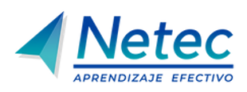

# Inteligencia Artificial Generativa Essentials

## Plataforma de laboratorios

Te damos la bienvenida a la **plataforma de laboratorios** del curso **Inteligencia Artificial Generativa Essentials**. Aquí podrás explorar diferentes tecnologías a través de prácticas guiadas. ¡Desarrolla tus habilidades y lleva tus conocimientos al siguiente nivel!

## Lista de laboratorios

Cada uno de estos laboratorios está diseñado para ofrecerte una experiencia práctica. Haz clic en los enlaces para comenzar.

### Módulo 1. Introducción a la Inteligencia Artificial Generativa

#### [Práctica 1. Explorar integraciones de IA en PartyRock](./Modulo-1.-Introduccion-a-la-Inteligencia-Artificial-Generativa/Practica-1.md)
- **Descripción**: Explorar de forma interactiva cómo funciona la IA generativa mediante el uso de PartyRock, identificando sus capacidades, tipos de interacción y diferencias frente a sistemas tradicionales.
- ⏱️ **Duración estimada**: 20 min

### Módulo 2. Seguridad y Ética en la Era de la IA

#### [Práctica 1. Detectar y corregir sesgos algorítmicos con instrucciones de control](./Modulo-2.-Seguridad-y-Etica-en-la-Era-de-la-IA/Practica-1.md)
- **Descripción**: Analizar respuestas generadas por IA para identificar posibles sesgos y aplicar instrucciones específicas que permitan obtener resultados más equilibrados, controlados y alineados con principios éticos organizacionales.
- ⏱️ **Duración estimada**: 15 min

#### [Práctica 2. Verificación cruzada y razonamiento lógico para detectar inconsistencias](./Modulo-2.-Seguridad-y-Etica-en-la-Era-de-la-IA/Practica-2.md)
- **Descripción**: Aplicar metodologías de validación y contraste de información para identificar inconsistencias en las respuestas generadas por la IA, fortaleciendo la confiabilidad en procesos de análisis y toma de decisiones.
- ⏱️ **Duración estimada**: 15 min
 
#### [Práctica 3. Evaluar riesgos de prompts mal definidos](./Modulo-2.-Seguridad-y-Etica-en-la-Era-de-la-IA/Practica-3.md)
- **Descripción**: Examinar cómo la formulación inadecuada de prompts puede provocar la generación de información incorrecta o sensible, comprendiendo la importancia de definir instrucciones claras y controladas.
- ⏱️ **Duración estimada**: 15 min

#### [Práctica 4. Identificar PII y aplicar protocolos de anonimización antes de usar IA](./Modulo-2.-Seguridad-y-Etica-en-la-Era-de-la-IA/Practica-4.md)
- **Descripción**: Reconocer datos sensibles dentro de la información utilizada en IA y aplicar técnicas de anonimización para proteger la privacidad y cumplir con buenas prácticas de manejo de datos.
- ⏱️ **Duración estimada**: 15 min

### Módulo 3. Fundamentos de la ingeniería de prompts

#### [Práctica 1. Crear prompts interactivos con Say What You See — Google Arts & Culture](./Modulo-3.-Fundamentos-de-la-ingenieria-de-prompts/Practica-1.md)
- **Descripción**: Desarrollar habilidades para construir prompts claros y estructurados mediante ejercicios guiados, comprendiendo cómo la precisión en las instrucciones impacta directamente en la calidad de las respuestas generadas.
- ⏱️ **Duración estimada**: 10 min

#### [Práctica 2. Análisis financiero con y sin contexto para evaluar confiabilidad](./Modulo-3.-Fundamentos-de-la-ingenieria-de-prompts/Practica-2.md)
- **Descripción**: Comparar resultados generados por la IA con diferentes niveles de contexto para comprender cómo la calidad, precisión y utilidad de las respuestas depende de la información proporcionada.
- ⏱️ **Duración estimada**: 15 min
 
#### [Práctica 3. Comparar prompts genéricos vs estructurados](./Modulo-3.-Fundamentos-de-la-ingenieria-de-prompts/Practica-3.md)
- **Descripción**: Evaluar la diferencia entre prompts simples y estructurados, identificando cómo el uso de criterios, restricciones y objetivos mejora significativamente la precisión de los resultados obtenidos.
- ⏱️ **Duración estimada**: 15 min

#### [Práctica 4. Aplicar Chain of Thought y Few-Shot](./Modulo-3.-Fundamentos-de-la-ingenieria-de-prompts/Practica-4.md)
- **Descripción**: Diseñar prompts avanzados que incorporen razonamiento paso a paso y ejemplos previos, con el objetivo de mejorar la precisión en tareas complejas y reducir errores en los resultados generados.
- ⏱️ **Duración estimada**: 15 min

### Módulo 4. Análisis de Datos y Visión Artificial

#### [Práctica 1. Categorizar datos con NLP](./Modulo-4.-Analisis-de-Datos-y-Vision-Artificial/Practica-1.md)
- **Descripción**: Aplicar técnicas de procesamiento de lenguaje natural para organizar grandes volúmenes de datos no estructurados, transformándolos en información útil que facilite el análisis y la generación de indicadores estratégicos.
- ⏱️ **Duración estimada**: 20 min

#### [Práctica 2. Extraer información de imágenes y cruzarla con datos](./Modulo-4.-Analisis-de-Datos-y-Vision-Artificial/Practica-2.md)
- **Descripción**: Utilizar capacidades de visión artificial para extraer información relevante de imágenes y combinarla con datos estructurados, generando análisis más completos y útiles para la toma de decisiones.
- ⏱️ **Duración estimada**: 20 min

#### [Práctica 3. Digitalizar información desde medios físicos](./Modulo-4.-Analisis-de-Datos-y-Vision-Artificial/Practica-3.md)
- **Descripción**: Implementar herramientas de IA multimodal para automatizar la extracción de datos desde documentos físicos o imágenes, optimizando procesos de digitalización y gestión de información.
- ⏱️ **Duración estimada**: 20 min

#### [Práctica 4. Convertir diagramas a estructuras digitales](./Modulo-4.-Analisis-de-Datos-y-Vision-Artificial/Practica-4.md)
- **Descripción**: Transformar representaciones visuales o esquemas en estructuras digitales organizadas mediante IA, facilitando la documentación formal y la comunicación de procesos dentro de la organización.
- ⏱️ **Duración estimada**: 15 min

### Módulo 5. Panorama Competitivo y Aplicación Industrial

#### [Práctica 1. Comparar herramientas con información compleja](./Modulo-5.-Panorama-Competitivo-y-Aplicacion-Industrial/Practica-1.md)
- **Descripción**: Evaluar el desempeño de distintas plataformas de inteligencia artificial al procesar información compleja, identificando diferencias en precisión, velocidad y utilidad para distintos contextos empresariales.
- ⏱️ **Duración estimada**: 15 min

#### [Práctica 2. Análisis comparativo por industria](./Modulo-5.-Panorama-Competitivo-y-Aplicacion-Industrial/Practica-2.md)
- **Descripción**: Analizar el comportamiento de distintas herramientas de IA en escenarios de negocio específicos, considerando factores como regulación, seguridad, trazabilidad y flexibilidad de uso.
- ⏱️ **Duración estimada**: 15 min

#### [Práctica 3. Evaluar multimodalidad en análisis empresarial](./Modulo-5.-Panorama-Competitivo-y-Aplicacion-Industrial/Practica-3.md)
- **Descripción**: Determinar el valor de integrar texto e imágenes en el análisis con IA, comparando resultados frente a enfoques tradicionales basados únicamente en información textual.
- ⏱️ **Duración estimada**: 15 min

### Módulo 6. El Ecosistema de Microsoft Copilot

#### Práctica 1. Generar planes de proyecto con Copilot
- **Descripción**: Utilizar Microsoft Copilot para transformar descripciones generales en planes de trabajo estructurados, incluyendo tareas, responsables y tiempos, facilitando la organización de proyectos.
- ⏱️ **Duración estimada**: 20 min

#### Práctica 2. Transformar texto en documentos estructurados
- **Descripción**: Aplicar capacidades de IA para convertir información básica en documentos formales y estructurados, mejorando la calidad y consistencia de la documentación organizacional.
- ⏱️ **Duración estimada**: 20 min

#### Práctica 3. Integrar análisis de datos y generación de contenido
- **Descripción**: Automatizar un flujo completo que integre análisis de datos, generación de documentos y creación de presentaciones, demostrando el potencial de la IA en procesos end-to-end.
- ⏱️ **Duración estimada**: 20 min

### Módulo 7. El Ecosistema de Google Gemini

#### Práctica 1. Sintetizar información con NotebookLM
- **Descripción**: Utilizar herramientas de IA para consolidar múltiples fuentes de información en resúmenes claros y estructurados, facilitando la comprensión y el aprovechamiento del conocimiento organizacional.
- ⏱️ **Duración estimada**: 15 min

#### Práctica 2. Orquestar información en Gemini App
- **Descripción**: Aplicar capacidades de IA para integrar y recuperar información dispersa, automatizando procesos administrativos y mejorando la eficiencia en la gestión de datos.
- ⏱️ **Duración estimada**: 15 min

#### Práctica 3. Generar activos visuales con IA
- **Descripción**: Crear materiales visuales de alta calidad mediante herramientas de IA, optimizando la comunicación de ideas y la generación de contenido para presentaciones corporativas.
- ⏱️ **Duración estimada**: 15 min

#### Práctica 4. Procesar documentos masivos con AI Studio
- **Descripción**: Utilizar plataformas de IA para analizar grandes volúmenes de documentos no estructurados, extrayendo información clave que facilite la toma de decisiones empresariales.
- ⏱️ **Duración estimada**: 15 min

### Módulo 8. El Ecosistema de OpenAI ChatGPT

#### Práctica 1. Analizar datos con Advanced Data Analysis
- **Descripción**: Aplicar capacidades avanzadas de análisis de datos para interpretar información compleja y transformarla en resultados claros, accionables y orientados a la toma de decisiones.
- ⏱️ **Duración estimada**: 15 min

#### Práctica 2. Crear un GPT especializado
- **Descripción**: Diseñar un agente personalizado capaz de analizar, comparar y generar información relevante a partir de documentos, adaptado a necesidades específicas de la organización.
- ⏱️ **Duración estimada**: 15 min

### Módulo 9. Arquitectura de Agentes de IA

#### Práctica 1. Explorar soluciones basadas en agentes
- **Descripción**: Explorar ejemplos reales de agentes de IA para comprender su aplicación en procesos organizacionales y su impacto en la automatización de tareas.
- ⏱️ **Duración estimada**: 6 min

#### Práctica 2. Diferenciar asistente vs agente
- **Descripción**: Identificar las diferencias funcionales entre asistentes y agentes de IA, comprendiendo sus roles dentro de procesos automatizados y su nivel de autonomía.
- ⏱️ **Duración estimada**: 10 min

#### Práctica 3. Diseñar la estructura de un agente
- **Descripción**: Implementar herramientas de IA multimodal para automatizar la extracción de datos desde documentos físicos o imágenes, optimizando procesos de digitalización y gestión de información.
- ⏱️ **Duración estimada**: 10 min

#### Práctica 4. Definir manejo de excepciones (Manual de Crisis)
- **Descripción**: Transformar representaciones visuales o esquemas en estructuras digitales organizadas mediante IA, facilitando la documentación formal y la comunicación de procesos dentro de la organización.
- ⏱️ **Duración estimada**: 10 min

#### Práctica 5. Gestionar fuentes de conocimiento
- **Descripción**: Seleccionar, organizar y estructurar fuentes de información que alimenten a un agente, asegurando la calidad, precisión y actualización de sus respuestas.
- ⏱️ **Duración estimada**: 10 min

### Módulo 10. Desarrollo de GPTs y Gems

#### Práctica 1. Construir agentes en ChatGPT
- **Descripción**: Desarrollar agentes personalizados en ChatGPT mediante la integración de bases de conocimiento, asegurando respuestas precisas y alineadas a necesidades específicas del usuario.
- ⏱️ **Duración estimada**: 20 min

#### Práctica 2. Diseñar Gems en Gemini
- **Descripción**: Crear agentes personalizados en Gemini que automaticen tareas creativas y operativas, aprovechando capacidades de aprendizaje guiado y generación multimodal.
- ⏱️ **Duración estimada**: 20 min

### Módulo 11. Implementación de agentes en el flujo de trabajo con Copilot Studio

#### Práctica 1. Implementar agentes en Copilot Studio
- **Descripción**: Integrar un agente en un flujo de trabajo real utilizando Copilot Studio, automatizando tareas, consultas y procesos organizacionales de manera eficiente.
- ⏱️ **Duración estimada**: 45 min

---

## 📬 **Contacto y más información**

Si tienes alguna pregunta o necesitas más detalles, no dudes en [contactarnos](mailto:soporte@netec.com). También puedes encontrar más recursos en nuestra [página](https://netec.com).

---

¡Gracias por visitar nuestra plataforma! No olvides revisar todos los laboratorios y comenzar tu viaje de aprendizaje hoy mismo.
